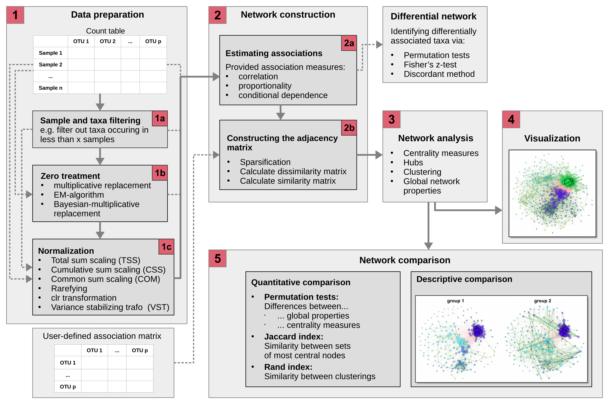

<!-- badges: start -->

[](https://lifecycle.r-lib.org/articles/stages.html#stable)
[](https://zenodo.org/badge/latestdoi/259906607)
[](https://doi.org/10.1093/bib/bbaa290)
[](https://anaconda.org/bioconda/r-netcomi)
<!-- badges: end -->

# NetCoMi <a href="https://stefpeschel.github.io/NetCoMi/"></a>

NetCoMi (**Net**work **Co**nstruction and Comparison for **Mi**crobiome
Data) is an R package designed to facilitate the construction, analysis,
and comparison of networks tailored to microbial compositional data. It
implements a comprehensive workflow introduced in [Peschel et
al. (2020)](https://academic.oup.com/bib/advance-article/doi/10.1093/bib/bbaa290/6017455),
which guides users through each step of network generation and analysis
with a strong emphasis on reproducibility and computational efficiency.

With NetCoMi, users can construct microbial association or dissimilarity
networks directly from sequencing data, typically provided as a read
count matrix. The package includes a broad selection of methods for
handling zeros, normalizing data, computing associations between
microbial taxa, and sparsifying the resulting matrices. By offering
these components in a modular format, NetCoMi allows users to tailor the
workflow to their specific research needs, creating highly customizable
microbial networks.

The package supports both the construction, analysis, and visualization
of a **single network** and the **comparison of two networks** through
graphical and quantitative approaches, including statistical testing.
Additionally, NetCoMi offers the capability of constructing
**differential networks**, where only differentially associated taxa are
connected.


> Exemplary network comparison using soil microbiome data ([‘soilrep’
> data from phyloseq
> package](https://github.com/joey711/phyloseq/blob/master/data/soilrep.RData)).
> Microbial associations are compared between the two experimantal
> settings ‘warming’ and ‘non-warming’ using the same layout in both
> groups.

## Workflow



## Methods included in NetCoMi

Here is an overview of methods available for network construction,
together with some information on their implementation in R:

**Association measures:**

- Pearson coefficient
  ([`cor()`](https://www.rdocumentation.org/packages/stats/versions/3.6.2/topics/cor)
  from `stats` package)
- Spearman coefficient
  ([`cor()`](https://www.rdocumentation.org/packages/stats/versions/3.6.2/topics/cor)
  from `stats` package)
- Biweight Midcorrelation
  [`bicor()`](https://rdrr.io/cran/WGCNA/man/bicor.html) from `WGCNA`
  package
- SparCC
  ([`sparcc()`](https://rdrr.io/github/zdk123/SpiecEasi/man/sparcc.html)
  from `SpiecEasi` package)
- CCLasso ([R code on GitHub](https://github.com/huayingfang/CCLasso))
- CCREPE
  ([`ccrepe`](https://bioconductor.org/packages/release/bioc/html/ccrepe.html)
  package)
- SpiecEasi ([`SpiecEasi`](https://github.com/zdk123/SpiecEasi) package)
- SPRING ([`SPRING`](https://github.com/GraceYoon/SPRING) package)
- gCoda ([R code on GitHub](https://github.com/huayingfang/gCoda))
- propr
  ([`propr`](https://cran.r-project.org/web/packages/propr/index.html)
  package)

**Dissimilarity measures:**

- Euclidean distance
  ([`vegdist()`](https://www.rdocumentation.org/packages/vegan/versions/2.4-2/topics/vegdist)
  from `vegan` package)
- Bray-Curtis dissimilarity
  ([`vegdist()`](https://www.rdocumentation.org/packages/vegan/versions/2.4-2/topics/vegdist)
  from `vegan` package)
- Kullback-Leibler divergence (KLD)
  ([`KLD()`](https://rdrr.io/cran/LaplacesDemon/man/KLD.html) from
  `LaplacesDemon` package)
- Jeffrey divergence (own code using
  [`KLD()`](https://rdrr.io/cran/LaplacesDemon/man/KLD.html) from
  `LaplacesDemon` package)
- Jensen-Shannon divergence (own code using
  [`KLD()`](https://rdrr.io/cran/LaplacesDemon/man/KLD.html) from
  `LaplacesDemon` package)
- Compositional KLD (own implementation following Martin-Fernández et
  al. (1999))
- Aitchison distance
  ([`vegdist()`](https://www.rdocumentation.org/packages/vegan/versions/2.4-2/topics/vegdist)
  and [`clr()`](https://rdrr.io/github/zdk123/SpiecEasi/man/clr.html)
  from `SpiecEasi` package)

**Methods for zero replacement:**

- Add a predefined pseudo count to the count table
- Replace only zeros in the count table by a predefined pseudo count
  (ratios between non-zero values are preserved)
- Multiplicative replacement
  ([`multRepl`](https://rdrr.io/cran/zCompositions/man/multRepl.html)
  from `zCompositions` package)
- Modified EM alr-algorithm
  ([`lrEM`](https://rdrr.io/cran/zCompositions/man/lrEM.html) from
  `zCompositions` package)
- Bayesian-multiplicative replacement
  ([`cmultRepl`](https://rdrr.io/cran/zCompositions/man/cmultRepl.html)
  from `zCompositions` package)

**Normalization methods:**

- Total Sum Scaling (TSS) (own implementation)
- Cumulative Sum Scaling (CSS) ([`cumNormMat`]() from `metagenomeSeq`
  package)
- Common Sum Scaling (COM) (own implementation)
- Rarefying ([`rrarefy`]() from `vegan` package)
- Variance Stabilizing Transformation (VST)
  ([`varianceStabilizingTransformation`]() from `DESeq2` package)
- Centered log-ratio (clr) transformation
  ([`clr()`](https://rdrr.io/github/zdk123/SpiecEasi/man/clr.html) from
  `SpiecEasi` package))

TSS, CSS, COM, VST, and the clr transformation are described in (Badri
et al. 2020).

## Installation

``` r
# Required packages
install.packages("devtools")
install.packages("BiocManager")

# Since two of NetCoMi's dependencies are only available on GitHub, it is 
# recommended to install them first:
devtools::install_github("zdk123/SpiecEasi")
devtools::install_github("GraceYoon/SPRING")

# Install NetCoMi
devtools::install_github("stefpeschel/NetCoMi", 
                         dependencies = c("Depends", "Imports", "LinkingTo"),
                         repos = c("https://cloud.r-project.org/",
                                   BiocManager::repositories()))
```

If there are any errors during installation, please install the missing
dependencies manually.

Packages that are optionally required in certain settings are not
installed together with NetCoMi. These can be installed automatically
using:

``` r
installNetCoMiPacks()
```

If not installed via `installNetCoMiPacks()`, the required package is
installed by the respective NetCoMi function when needed.

## Bioconda

Thanks to [daydream-boost](https://github.com/daydream-boost), NetCoMi
can also be installed from conda bioconda channel with

``` bash
# You can install an individual environment firstly with
# conda create -n NetCoMi
# conda activate NetCoMi
conda install -c bioconda -c conda-forge r-netcomi
```

## Development version

Everyone who wants to use new features not included in any releases is
invited to install NetCoMi’s development version:

``` r
devtools::install_github("stefpeschel/NetCoMi", 
                         ref = "develop",
                         dependencies = c("Depends", "Imports", "LinkingTo"),
                         repos = c("https://cloud.r-project.org/",
                                   BiocManager::repositories()))
```

Please check the
[NEWS](https://github.com/stefpeschel/NetCoMi/blob/develop/NEWS.md)
document for features implemented on develop branch.

## References

<div id="refs" class="references csl-bib-body hanging-indent"
entry-spacing="0">

<div id="ref-badri2020shrinkage" class="csl-entry">

Badri, Michelle, Zachary D. Kurtz, Richard Bonneau, and Christian L.
Müller. 2020. “Shrinkage Improves Estimation of Microbial Associations
Under Different Normalization Methods.” *NAR Genomics and
Bioinformatics* 2 (December). <https://doi.org/10.1093/NARGAB/LQAA100>.

</div>

<div id="ref-martin1999measure" class="csl-entry">

Martin-Fernández, Josep A, M Bren, Carles Barceló-Vidal, and Vera
Pawlowsky-Glahn. 1999. “A Measure of Difference for Compositional Data
Based on Measures of Divergence.” In *Proceedings of IAMG*, 99:211–16.

</div>

</div>
