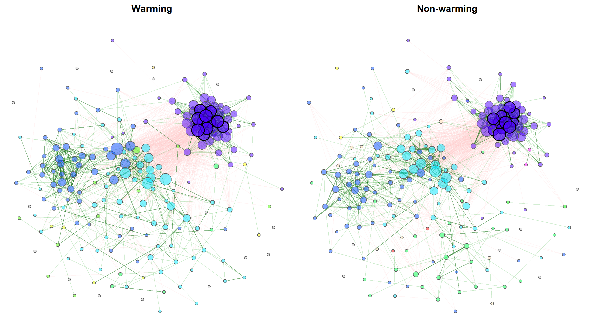

```{r setup, echo = FALSE}
knitr::opts_chunk$set(fig.path="man/figures/readme/")
```

# NetCoMi 

[](https://zenodo.org/badge/latestdoi/259906607)
[](https://anaconda.org/bioconda/r-netcomi)

NetCoMi (**Net**work **Co**nstruction and Comparison for **Mi**crobiome Data) 
provides functionality for constructing, analyzing, and comparing networks 
suitable for the application on microbial compositional data. 
The R package implements the workflow proposed in 

Stefanie Peschel, Christian L M&uuml;ller, Erika von Mutius, Anne-Laure 
Boulesteix, Martin Depner (2020). 
[NetCoMi: network construction and comparison for microbiome data in R](https://academic.oup.com/bib/advance-article/doi/10.1093/bib/bbaa290/6017455). 
*Briefings in Bioinformatics*, bbaa290. https://doi.org/10.1093/bib/bbaa290.

NetCoMi allows its users to construct, analyze, and compare microbial association or 
dissimilarity networks in a fast and reproducible manner. 
Starting with a read count matrix originating from a sequencing process, the 
pipeline includes a wide range of
existing methods for treating zeros in the data, normalization, 
computing microbial associations or dissimilarities, and sparsifying the 
resulting association/ dissimilarity matrix. These methods can be combined in a 
modular fashion to generate microbial networks.
NetCoMi can either be used for constructing, analyzing and visualizing a single 
network, or for comparing two networks in a graphical as well as a quantitative 
manner, including statistical tests. The package furthermore offers 
functionality for constructing differential networks, where only differentially 
associated taxa are connected.



```{r networkplot, eval=FALSE, echo=FALSE, message=FALSE, warning=FALSE, fig.height=16, fig.width=29}
library(phyloseq)
library(NetCoMi)
data("soilrep")

soil_warm_yes <- phyloseq::subset_samples(soilrep, warmed == "yes")
soil_warm_no  <- phyloseq::subset_samples(soilrep, warmed == "no")

net_seas_p <- netConstruct(soil_warm_yes, soil_warm_no,
                           filtTax = "highestVar",
                           filtTaxPar = list(highestVar = 500),
                           zeroMethod = "pseudo",
                           normMethod = "clr",
                           measure = "pearson",
                           verbose = 0)

netprops1 <- netAnalyze(net_seas_p, clustMethod = "cluster_fast_greedy",
                        gcmHeat = FALSE)

nclust <- as.numeric(max(names(table(netprops1$clustering$clust1))))

col <- c(topo.colors(nclust), rainbow(6))

plot(netprops1, 
     sameLayout = TRUE, 
     layoutGroup = "union", 
     colorVec = col,
     borderCol = "gray40", 
     nodeSize = "degree", 
     cexNodes = 0.9, 
     nodeSizeSpread = 3, 
     edgeTranspLow = 80, 
     edgeTranspHigh = 50,
     groupNames = c("Warming", "Non-warming"), 
     showTitle = TRUE, 
     cexTitle = 2.8,
     mar = c(1,1,3,1), 
     repulsion = 0.9, 
     labels = FALSE, 
     rmSingles = "inboth",
     nodeFilter = "clustMin", 
     nodeFilterPar = 10, 
     nodeTransp = 50, 
     hubTransp = 30)
```

> Exemplary network comparison using soil microbiome data (['soilrep' data from 
phyloseq package](https://github.com/joey711/phyloseq/blob/master/data/soilrep.RData)). 
Microbial associations are compared between the two experimantal settings 
'warming' and 'non-warming' using the same layout in both groups. 

## Table of Contents

1. [Methods included in NetCoMi](#methods-included-in-NetCoMi)
2. [Installation](#installation)
3. [Development version](#development-version)
4. [Usage](#usage)
    + [Network with SPRING as association measure](#network-with-spring-as-association-measure)
    + [Export to Gephi](#export-to-gephi)
    + [Network with Pearson correlations](#network-with-pearson-correlation-as-association-measure)
    + ["Unsigned" transformation](#using-the-unsigned-transformation)
    + [Network on genus level](#network-on-genus-level)
    + [Association matrix as input](#using-an-association-matrix-as-input)
    + [Network comparison](#network-comparison)
    + [Differential networks](#differential-networks)
    + [Dissimilarity-based Networks](#dissimilarity-based-networks)
    + [Soil microbiome example](#soil-microbiome-example)
5. [References](#references)

## Methods included in NetCoMi

Here is an overview of methods available for network construction, together with
some information on their implementation in R:

**Association measures:**

- Pearson coefficient ([`cor()`](https://www.rdocumentation.org/packages/stats/versions/3.6.2/topics/cor) from `stats` package)
- Spearman coefficient ([`cor()`](https://www.rdocumentation.org/packages/stats/versions/3.6.2/topics/cor) from `stats` package)
- Biweight Midcorrelation [`bicor()`](https://rdrr.io/cran/WGCNA/man/bicor.html) from `WGCNA` package
- SparCC ([`sparcc()`](https://rdrr.io/github/zdk123/SpiecEasi/man/sparcc.html) from `SpiecEasi` package)
- CCLasso ([R code on GitHub](https://github.com/huayingfang/CCLasso))
- CCREPE ([`ccrepe`](https://bioconductor.org/packages/release/bioc/html/ccrepe.html) package)
- SpiecEasi ([`SpiecEasi`](https://github.com/zdk123/SpiecEasi) package)
- SPRING ([`SPRING`](https://github.com/GraceYoon/SPRING) package)
- gCoda ([R code on GitHub](https://github.com/huayingfang/gCoda))
- propr ([`propr`](https://cran.r-project.org/web/packages/propr/index.html) package)

**Dissimilarity measures:**

- Euclidean distance ([`vegdist()`](https://www.rdocumentation.org/packages/vegan/versions/2.4-2/topics/vegdist) from `vegan` package)
- Bray-Curtis dissimilarity ([`vegdist()`](https://www.rdocumentation.org/packages/vegan/versions/2.4-2/topics/vegdist) 
from `vegan` package)
- Kullback-Leibler divergence (KLD) ([`KLD()`](https://rdrr.io/cran/LaplacesDemon/man/KLD.html) 
from `LaplacesDemon` package)
- Jeffrey divergence (own code using [`KLD()`](https://rdrr.io/cran/LaplacesDemon/man/KLD.html) 
from `LaplacesDemon` package)
- Jensen-Shannon divergence (own code using [`KLD()`](https://rdrr.io/cran/LaplacesDemon/man/KLD.html) from `LaplacesDemon` package)
- Compositional KLD (own implementation following @martin1999measure)
- Aitchison distance ([`vegdist()`](https://www.rdocumentation.org/packages/vegan/versions/2.4-2/topics/vegdist) and [`clr()`](https://rdrr.io/github/zdk123/SpiecEasi/man/clr.html) from `SpiecEasi` package)

**Methods for zero replacement:**

- Add a predefined pseudo count to the count table
- Replace only zeros in the count table by a predefined pseudo count (ratios between non-zero values are preserved)
- Multiplicative replacement ([`multRepl`](https://rdrr.io/cran/zCompositions/man/multRepl.html) 
from `zCompositions` package)
- Modified EM alr-algorithm ([`lrEM`](https://rdrr.io/cran/zCompositions/man/lrEM.html) 
from `zCompositions` package)
- Bayesian-multiplicative replacement ([`cmultRepl`](https://rdrr.io/cran/zCompositions/man/cmultRepl.html) 
from `zCompositions` package)

**Normalization methods:**

- Total Sum Scaling (TSS) (own implementation)
- Cumulative Sum Scaling (CSS) ([`cumNormMat`]() from `metagenomeSeq` package)
- Common Sum Scaling (COM) (own implementation)
- Rarefying ([`rrarefy`]() from `vegan` package)
- Variance Stabilizing Transformation (VST) ([`varianceStabilizingTransformation`]() from `DESeq2` package)
- Centered log-ratio (clr) transformation ([`clr()`](https://rdrr.io/github/zdk123/SpiecEasi/man/clr.html) from 
`SpiecEasi` package))

TSS, CSS, COM, VST, and the clr transformation are described in [@badri2020shrinkage]. 

## Installation

```{r install, eval=FALSE}
# Required packages
install.packages("devtools")
install.packages("BiocManager")

# Install NetCoMi
devtools::install_github("stefpeschel/NetCoMi", 
                         dependencies = c("Depends", "Imports", "LinkingTo"),
                         repos = c("https://cloud.r-project.org/",
                                   BiocManager::repositories()))
```

If there are any errors during installation, please install the missing 
dependencies manually.

In particular the automatic installation of 
[`SPRING`](https://github.com/GraceYoon/SPRING) and  [`SpiecEasi`](https://github.com/zdk123/SpiecEasi) (only available on 
GitHub) does sometimes not work. These packages can be installed as follows 
(the order is important because SPRING depends on SpiecEasi):

```{r install2, eval=FALSE}
devtools::install_github("zdk123/SpiecEasi")
devtools::install_github("GraceYoon/SPRING")
```

Packages that are optionally required in certain settings are not installed 
together with NetCoMi. These can be installed automatically using:

```{r install3, eval=FALSE}
installNetCoMiPacks()

# Please check:
?installNetCoMiPacks()
```

If not installed via `installNetCoMiPacks()`, the required package is installed
by the respective NetCoMi function when needed.

### Bioconda

Thanks to [daydream-boost](https://github.com/daydream-boost), NetCoMi can also
be installed from conda bioconda channel with

```bash
# You can install an individual environment firstly with
# conda create -n NetCoMi
# conda activate NetCoMi
conda install -c bioconda -c conda-forge r-netcomi
```

## Development version

Everyone who wants to use new features not included in any releases 
is invited to install NetCoMi's development version:

```{r install4, eval=FALSE}
devtools::install_github("stefpeschel/NetCoMi", 
                         ref = "develop",
                         dependencies = c("Depends", "Imports", "LinkingTo"),
                         repos = c("https://cloud.r-project.org/",
                                   BiocManager::repositories()))
```

Please check the [NEWS](https://github.com/stefpeschel/NetCoMi/blob/develop/NEWS.md) 
document for features implemented on develop branch.

## Usage

We use the American Gut data from [`SpiecEasi`](https://github.com/zdk123/SpiecEasi) 
package to look at some examples of how NetCoMi is applied. NetCoMi's main 
functions are `netConstruct()` for network construction, `netAnalyze()` for 
network analysis, and `netCompare()` for network comparison. 
As you will see in the following, these three functions must 
be executed in the aforementioned order. A further function is `diffnet()` for 
constructing a differential association network. `diffnet()` must be applied to 
the object returned by `netConstruct()`.

First of all, we load NetCoMi and the data from American Gut Project (provided 
by [`SpiecEasi`](https://github.com/zdk123/SpiecEasi), which is automatically 
loaded together with NetCoMi).
```{r load_data, message=FALSE, warning=FALSE,}
library(NetCoMi)
data("amgut1.filt")
data("amgut2.filt.phy")
```

### Network with SPRING as association measure

#### Network construction and analysis

We firstly construct a single association network using 
[SPRING](https://github.com/GraceYoon/SPRING) for 
estimating associations (conditional dependence) between OTUs. 

The data are filtered within `netConstruct()` as follows:

- Only samples with a total number of reads of at least 1000 are included 
(argument `filtSamp`). 
- Only the 50 taxa with highest frequency are included (argument `filtTax`).

`measure` defines the association or dissimilarity measure, which is `"spring"` 
in our case. Additional arguments are passed to `SPRING()` via `measurePar`. 
`nlambda` and `rep.num` are set to 10 for a decreased execution time, but should 
be higher for real data. `Rmethod` is set to “approx” to estimate the correlations using a hybrid multi-linear interpolation approach proposed by @yoon2020fast. This method considerably reduces the runtime while controlling the approximation error.

Normalization as well as zero handling is performed internally in `SPRING()`. 
Hence, we set `normMethod` and `zeroMethod` to `"none"`.

We furthermore set `sparsMethod` to `"none"` because `SPRING` returns a sparse
network where no additional sparsification step is necessary.

We use the "signed" method for transforming associations into dissimilarities 
(argument `dissFunc`). In doing so, strongly negatively associated taxa have a 
high dissimilarity and, in turn, a low similarity, which corresponds to edge 
weights in the network plot.

The `verbose` argument is set to 3 so that all messages generated by 
`netConstruct()` as well as messages of external functions are printed.

```{r single_spring}
net_spring <- netConstruct(amgut1.filt,
                           filtTax = "highestFreq",
                           filtTaxPar = list(highestFreq = 50),
                           filtSamp = "totalReads",
                           filtSampPar = list(totalReads = 1000),
                           measure = "spring",
                           measurePar = list(nlambda=10, 
                                             rep.num=10,
                                             Rmethod = "approx"),
                           normMethod = "none", 
                           zeroMethod = "none",
                           sparsMethod = "none", 
                           dissFunc = "signed",
                           verbose = 2,
                           seed = 123456)
```

#### Analyzing the constructed network

NetCoMi's `netAnalyze()` function is used for analyzing the constructed 
network(s).

Here, `centrLCC` is set to `TRUE` meaning that centralities are calculated only 
for nodes in the largest connected component (LCC). 

Clusters are identified using greedy modularity optimization 
(by `cluster_fast_greedy()` from [`igraph`](https://igraph.org/r/) package).

Hubs are nodes with an eigenvector centrality value above the empirical 
95% quantile of all eigenvector centralities in the network (argument `hubPar`).

`weightDeg` and `normDeg` are set to `FALSE` so that the degree of a node is
simply defined as number of nodes that are adjacent to the node.

By default, a heatmap of the Graphlet Correlation Matrix (GCM) is returned (with 
graphlet correlations in the upper triangle and significance codes resulting 
from Student's t-test in the lower triangle). 
See `?calcGCM` and `?testGCM` for details.


```{r single_spring_2, fig.height=6, fig.width=6}
props_spring <- netAnalyze(net_spring, 
                           centrLCC = TRUE,
                           clustMethod = "cluster_fast_greedy",
                           hubPar = "eigenvector",
                           weightDeg = FALSE, normDeg = FALSE)

#?summary.microNetProps
summary(props_spring, numbNodes = 5L)
```

#### Plotting the GCM heatmap manually

```{r single_spring_heat, fig.height=6, fig.width=6}
plotHeat(mat = props_spring$graphletLCC$gcm1,
         pmat = props_spring$graphletLCC$pAdjust1,
         type = "mixed",
         title = "GCM", 
         colorLim = c(-1, 1),
         mar = c(2, 0, 2, 0))

# Add rectangles highlighting the four types of orbits
graphics::rect(xleft   = c( 0.5,  1.5, 4.5,  7.5),
               ybottom = c(11.5,  7.5, 4.5,  0.5),
               xright  = c( 1.5,  4.5, 7.5, 11.5),
               ytop    = c(10.5, 10.5, 7.5,  4.5),
               lwd = 2, xpd = NA)

text(6, -0.2, xpd = NA, 
     "Significance codes:  ***: 0.001;  **: 0.01;  *: 0.05")
```


#### Visualizing the network

We use the determined clusters as node colors and scale
the node sizes according to the node's eigenvector centrality. 

```{r helppage, eval=FALSE}
# help page
?plot.microNetProps
```

```{r single_spring_3, fig.height=18, fig.width=20}
p <- plot(props_spring, 
          nodeColor = "cluster", 
          nodeSize = "eigenvector",
          title1 = "Network on OTU level with SPRING associations", 
          showTitle = TRUE,
          cexTitle = 2.3)

legend(0.7, 1.1, cex = 2.2, title = "estimated association:",
       legend = c("+","-"), lty = 1, lwd = 3, col = c("#009900","red"), 
       bty = "n", horiz = TRUE)
```

Note that edge weights are (non-negative) similarities, however, the edges 
belonging to negative estimated associations are colored in red by default 
(`negDiffCol = TRUE`).

By default, a different transparency value is added to edges with an absolute 
weight below and above the `cut` value (arguments `edgeTranspLow` and 
`edgeTranspHigh`). The determined `cut` value can be read out as
follows:

```{r single_spring_4}
p$q1$Arguments$cut
```


### Export to Gephi

Some users may be interested in how to export the network to Gephi. Here's an example:

```{r}
# For Gephi, we have to generate an edge list with IDs.
# The corresponding labels (and also further node features) are stored as node list.

# Create edge object from the edge list exported by netConstruct()
edges <- dplyr::select(net_spring$edgelist1, v1, v2)

# Add Source and Target variables (as IDs)
edges$Source <- as.numeric(factor(edges$v1))
edges$Target <- as.numeric(factor(edges$v2))
edges$Type <- "Undirected"
edges$Weight <- net_spring$edgelist1$adja

nodes <- unique(edges[,c('v1','Source')])
colnames(nodes) <- c("Label", "Id")

# Add category with clusters (can be used as node colors in Gephi)
nodes$Category <- props_spring$clustering$clust1[nodes$Label]

edges <- dplyr::select(edges, Source, Target, Type, Weight)

write.csv(nodes, file = "nodes.csv", row.names = FALSE)
write.csv(edges, file = "edges.csv", row.names = FALSE)
```

The exported .csv files can then be imported into Gephi.

----

### Network with Pearson correlation as association measure

Let's construct another network using Pearson's correlation coefficient
as association measure. The input is now a `phyloseq` object.

Since Pearson correlations may lead to compositional effects when applied to 
sequencing data, we use the clr transformation as normalization method. Zero 
treatment is necessary in this case.

A threshold of 0.3 is used as sparsification method, so that only OTUs with an
absolute correlation greater than or equal to 0.3 are connected.


```{r single_pears_1, fig.height=18, fig.width=20}
net_pears <- netConstruct(amgut2.filt.phy,  
                          measure = "pearson",
                          normMethod = "clr",
                          zeroMethod = "multRepl",
                          sparsMethod = "threshold",
                          thresh = 0.3,
                          verbose = 3)
```

Network analysis and plotting:

```{r single_pears_2, fig.height=6, fig.width=6}
props_pears <- netAnalyze(net_pears, 
                          clustMethod = "cluster_fast_greedy")
```


```{r single_pears_3, fig.height=18, fig.width=20}
plot(props_pears, 
     nodeColor = "cluster", 
     nodeSize = "eigenvector",
     title1 = "Network on OTU level with Pearson correlations", 
     showTitle = TRUE,
     cexTitle = 2.3)

legend(0.7, 1.1, cex = 2.2, title = "estimated correlation:", 
       legend = c("+","-"), lty = 1, lwd = 3, col = c("#009900","red"), 
       bty = "n", horiz = TRUE)
```

Let's improve the visualization by changing the following arguments:

- `repulsion = 0.8`: Place the nodes further apart.
- `rmSingles = TRUE`: Single nodes are removed.
- `labelScale = FALSE` and `cexLabels = 1.6`: All labels have equal size and are
enlarged to improve readability of small node's labels.
- `nodeSizeSpread = 3` (default is 4): Node sizes are more similar if the value
is decreased. This argument (in combination with `cexNodes`) is useful to enlarge
small nodes while keeping the size of big nodes.
- `hubBorderCol = "darkgray"`: Change border color for a better readability of 
the node labels.

```{r single_pears_4, fig.height=18, fig.width=20}
plot(props_pears, 
     nodeColor = "cluster", 
     nodeSize = "eigenvector",
     repulsion = 0.8,
     rmSingles = TRUE,
     labelScale = FALSE,
     cexLabels = 1.6,
     nodeSizeSpread = 3,
     cexNodes = 2,
     hubBorderCol = "darkgray",
     title1 = "Network on OTU level with Pearson correlations", 
     showTitle = TRUE,
     cexTitle = 2.3)

legend(0.7, 1.1, cex = 2.2, title = "estimated correlation:",
       legend = c("+","-"), lty = 1, lwd = 3, col = c("#009900","red"),
       bty = "n", horiz = TRUE)
```

#### Edge filtering

The network can be sparsified further using the arguments `edgeFilter` (edges 
are filtered before the layout is computed) and `edgeInvisFilter` (edges are 
removed after the layout is computed and thus just made "invisible").

```{r single_pears_5, fig.height=18, fig.width=20}
plot(props_pears,
     edgeInvisFilter = "threshold",
     edgeInvisPar = 0.4,
     nodeColor = "cluster", 
     nodeSize = "eigenvector",
     repulsion = 0.8,
     rmSingles = TRUE,
     labelScale = FALSE,
     cexLabels = 1.6,
     nodeSizeSpread = 3,
     cexNodes = 2,
     hubBorderCol = "darkgray",
     title1 = paste0("Network on OTU level with Pearson correlations",
                     "\n(edge filter: threshold = 0.4)"),
     showTitle = TRUE,
     cexTitle = 2.3)

legend(0.7, 1.1, cex = 2.2, title = "estimated correlation:",
       legend = c("+","-"), lty = 1, lwd = 3, col = c("#009900","red"),
       bty = "n", horiz = TRUE)
```

----

### Using the "unsigned" transformation

In the above network, the "signed" transformation was used to transform 
the estimated associations into dissimilarities. This leads to a network where 
strongly positive correlated taxa have a high edge weight (1 if the correlation 
equals 1) and strongly negative correlated taxa have a low edge weight (0 if 
the correlation equals -1).

We now use the "unsigned" transformation so that the edge weight between 
strongly correlated taxa is high, no matter of the sign. Hence, a correlation of 
-1 and 1 would lead to an edge weight of 1. 

#### Network construction

We can pass the network object from before to `netConstruct()` to save runtime.

```{r single_pears_unsigned_2, fig.height=18, fig.width=20}
net_pears_unsigned <- netConstruct(data = net_pears$assoEst1,
                                   dataType = "correlation", 
                                   sparsMethod = "threshold",
                                   thresh = 0.3,
                                   dissFunc = "unsigned",
                                   verbose = 3)
```

#### Estimated correlations and adjacency values

The following histograms demonstrate how the estimated correlations are 
transformed into adjacencies (= sparsified similarities for weighted networks).

Sparsified estimated correlations:

```{r single_pears_hist_1, fig.height=4, fig.width=8}
hist(net_pears$assoMat1, 100, xlim = c(-1, 1), ylim = c(0, 400),
     xlab = "Estimated correlation", 
     main = "Estimated correlations after sparsification")
```

Adjacency values computed using the "signed" transformation (values different 
from 0 and 1 will be edges in the network):

```{r single_pears_hist_2, fig.height=4, fig.width=8}
hist(net_pears$adjaMat1, 100, ylim = c(0, 400),
     xlab = "Adjacency values", 
     main = "Adjacencies (with \"signed\" transformation)")
```

Adjacency values computed using the "unsigned" transformation:

```{r single_pears_hist_3, fig.height=4, fig.width=8}
hist(net_pears_unsigned$adjaMat1, 100, ylim = c(0, 400),
     xlab = "Adjacency values", 
     main = "Adjacencies (with \"unsigned\" transformation)")
```

#### Network analysis and plotting

```{r single_pears_unsigned_3, fig.height=6, fig.width=6}
props_pears_unsigned <- netAnalyze(net_pears_unsigned, 
                                   clustMethod = "cluster_fast_greedy",
                                   gcmHeat = FALSE)
```


```{r single_pears_unsigned_4, fig.height=18, fig.width=20}
plot(props_pears_unsigned, 
     nodeColor = "cluster", 
     nodeSize = "eigenvector",
     repulsion = 0.9,
     rmSingles = TRUE,
     labelScale = FALSE,
     cexLabels = 1.6,
     nodeSizeSpread = 3,
     cexNodes = 2,
     hubBorderCol = "darkgray",
     title1 = "Network with Pearson correlations and \"unsigned\" transformation", 
     showTitle = TRUE,
     cexTitle = 2.3)

legend(0.7, 1.1, cex = 2.2, title = "estimated correlation:",
       legend = c("+","-"), lty = 1, lwd = 3, col = c("#009900","red"),
       bty = "n", horiz = TRUE)
```

While with the "signed" transformation, positive correlated taxa are likely to 
belong to the same cluster, with the "unsigned" transformation clusters contain 
strongly positive and negative correlated taxa. 

----

### Network on genus level

We now construct a further network, where OTUs are agglomerated to genera. 

```{r single_genus_1, fig.height=6, fig.width=6}
library(phyloseq)
data("amgut2.filt.phy")

# Agglomerate to genus level
amgut_genus <- tax_glom(amgut2.filt.phy, taxrank = "Rank6")

# Taxonomic table
taxtab <- as(tax_table(amgut_genus), "matrix")

# Rename taxonomic table and make Rank6 (genus) unique
amgut_genus_renamed <- renameTaxa(amgut_genus, 
                                  pat = "<name>", 
                                  substPat = "<name>_<subst_name>(<subst_R>)",
                                  numDupli = "Rank6")

# Network construction and analysis
net_genus <- netConstruct(amgut_genus_renamed,
                          taxRank = "Rank6",
                          measure = "pearson",
                          zeroMethod = "multRepl",
                          normMethod = "clr",
                          sparsMethod = "threshold",
                          thresh = 0.3,
                          verbose = 3)

props_genus <- netAnalyze(net_genus, clustMethod = "cluster_fast_greedy")
```

#### Network plots

Modifications:

- Fruchterman-Reingold layout algorithm from `igraph` package used (passed to 
`plot` as matrix)
- Shortened labels (using the "intelligent" method, which avoids duplicates)
- Fixed node sizes, where hubs are enlarged
- Node color is gray for all nodes (transparancy is lower for hub nodes by default)

```{r single_genus_2, fig.height=18, fig.width=20}
# Compute layout
graph3 <- igraph::graph_from_adjacency_matrix(net_genus$adjaMat1, 
                                              weighted = TRUE)
set.seed(123456)
lay_fr <- igraph::layout_with_fr(graph3)

# Row names of the layout matrix must match the node names
rownames(lay_fr) <- rownames(net_genus$adjaMat1)

plot(props_genus,
     layout = lay_fr,
     shortenLabels = "intelligent",
     labelLength = 10,
     labelPattern = c(5, "'", 3, "'", 3),
     nodeSize = "fix",
     nodeColor = "gray",
     cexNodes = 0.8,
     cexHubs = 1.1,
     cexLabels = 1.2,
     title1 = "Network on genus level with Pearson correlations", 
     showTitle = TRUE,
     cexTitle = 2.3)

legend(0.7, 1.1, cex = 2.2, title = "estimated correlation:",
       legend = c("+","-"), lty = 1, lwd = 3, col = c("#009900","red"), 
       bty = "n", horiz = TRUE)
```

Since the above visualization is obviously not optimal, we make further 
adjustments:

- This time, the Fruchterman-Reingold layout algorithm is computed within the 
plot function and thus applied to the "reduced" network without singletons
- Labels are not scaled to node sizes
- Single nodes are removed
- Node sizes are scaled to the column sums of clr-transformed data
- Node colors represent the determined clusters
- Border color of hub nodes is changed from black to darkgray
- Label size of hubs is enlarged

```{r single_genus_3, fig.height=18, fig.width=20}
set.seed(123456)

plot(props_genus,
     layout = "layout_with_fr",
     shortenLabels = "intelligent",
     labelLength = 10,
     labelPattern = c(5, "'", 3, "'", 3),
     labelScale = FALSE,
     rmSingles = TRUE,
     nodeSize = "clr",
     nodeColor = "cluster",
     hubBorderCol = "darkgray",
     cexNodes = 2,
     cexLabels = 1.5,
     cexHubLabels = 2,
     title1 = "Network on genus level with Pearson correlations", 
     showTitle = TRUE,
     cexTitle = 2.3)

legend(0.7, 1.1, cex = 2.2, title = "estimated correlation:",
       legend = c("+","-"), lty = 1, lwd = 3, col = c("#009900","red"), 
       bty = "n", horiz = TRUE)
```

Let's check whether the largest nodes are actually those with highest 
column sums in the matrix with normalized counts returned by `netConstruct()`.

```{r single_genus_4}
sort(colSums(net_genus$normCounts1), decreasing = TRUE)[1:10]
```

In order to further improve our plot, we use the following modifications:

- This time, we choose the "spring" layout as part of `qgraph()` (the function 
is generally used for network plotting in NetCoMi)
- A repulsion value below 1 places the nodes further apart
- Labels are not shortened anymore
- Nodes (bacteria on genus level) are colored according to the respective phylum
- Edges representing positive associations are colored in blue, negative ones in
orange (just to give an example for alternative edge coloring)
- Transparency is increased for edges with high weight to improve the readability 
of node labels


```{r single_genus_5, fig.height=18, fig.width=20}
# Get phyla names
taxtab <- as(tax_table(amgut_genus_renamed), "matrix")
phyla <- as.factor(gsub("p__", "", taxtab[, "Rank2"]))
names(phyla) <- taxtab[, "Rank6"]
#table(phyla)

# Define phylum colors
phylcol <- c("cyan", "blue3", "red", "lawngreen", "yellow", "deeppink")

plot(props_genus,
     layout = "spring",
     repulsion = 0.84,
     shortenLabels = "none",
     charToRm = "g__",
     labelScale = FALSE,
     rmSingles = TRUE,
     nodeSize = "clr",
     nodeSizeSpread = 4,
     nodeColor = "feature", 
     featVecCol = phyla, 
     colorVec =  phylcol,
     posCol = "darkturquoise", 
     negCol = "orange",
     edgeTranspLow = 0,
     edgeTranspHigh = 40,
     cexNodes = 2,
     cexLabels = 2,
     cexHubLabels = 2.5,
     title1 = "Network on genus level with Pearson correlations", 
     showTitle = TRUE,
     cexTitle = 2.3)

# Colors used in the legend should be equally transparent as in the plot
phylcol_transp <- colToTransp(phylcol, 60)

legend(-1.2, 1.2, cex = 2, pt.cex = 2.5, title = "Phylum:", 
       legend=levels(phyla), col = phylcol_transp, bty = "n", pch = 16) 

legend(0.7, 1.1, cex = 2.2, title = "estimated correlation:",
       legend = c("+","-"), lty = 1, lwd = 3, col = c("darkturquoise","orange"), 
       bty = "n", horiz = TRUE)
```

----

### Using an association matrix as input

The QMP data set provided by the `SPRING` package is used to demonstrate how 
NetCoMi is used to analyze a precomputed network (given as association matrix).

The data set contains quantitative count data (true absolute values), which 
SPRING can deal with. See `?QMP` for details.

`nlambda` and `rep.num` are set to 10 for a decreased execution time, but should 
be higher for real data.

```{r association_input_1, message=FALSE}
library(SPRING)

# Load the QMP data set
data("QMP") 

# Run SPRING for association estimation
fit_spring <- SPRING(QMP, 
                     quantitative = TRUE, 
                     lambdaseq = "data-specific",
                     nlambda = 10, 
                     rep.num = 10,
                     seed = 123456, 
                     ncores = 1,
                     Rmethod = "approx",
                     verbose = FALSE)

# Optimal lambda
opt.K <- fit_spring$output$stars$opt.index
    
# Association matrix
assoMat <- as.matrix(SpiecEasi::symBeta(fit_spring$output$est$beta[[opt.K]],
                                        mode = "ave"))
rownames(assoMat) <- colnames(assoMat) <- colnames(QMP)
```

The association matrix is now passed to `netConstruct` to start the usual 
NetCoMi workflow. Note that the `dataType` argument must be set appropriately.

```{r association_input_2, fig.height=6, fig.width=6}
# Network construction and analysis
net_asso <- netConstruct(data = assoMat,
                         dataType = "condDependence",
                         sparsMethod = "none",
                         verbose = 0)

props_asso <- netAnalyze(net_asso, clustMethod = "hierarchical")
```


```{r association_input_3, fig.height=18, fig.width=20}
plot(props_asso,
     layout = "spring",
     repulsion = 1.2,
     shortenLabels = "none",
     labelScale = TRUE,
     rmSingles = TRUE,
     nodeSize = "eigenvector",
     nodeSizeSpread = 2,
     nodeColor = "cluster",
     hubBorderCol = "gray60",
     cexNodes = 1.8,
     cexLabels = 2,
     cexHubLabels = 2.2,
     title1 = "Network for QMP data", 
     showTitle = TRUE,
     cexTitle = 2.3)

legend(0.7, 1.1, cex = 2.2, title = "estimated association:",
       legend = c("+","-"), lty = 1, lwd = 3, col = c("#009900","red"), 
       bty = "n", horiz = TRUE)
```

----

### Network comparison

Now let's look how NetCoMi is used to compare two networks. 

#### Network construction

The data set is split by `"SEASONAL_ALLERGIES"` leading to two subsets of 
samples (with and without seasonal allergies). We ignore the "None" group.  

```{r netcomp_spring_0}
# Split the phyloseq object into two groups
amgut_season_yes <- phyloseq::subset_samples(amgut2.filt.phy, 
                                             SEASONAL_ALLERGIES == "yes")
amgut_season_no <- phyloseq::subset_samples(amgut2.filt.phy, 
                                            SEASONAL_ALLERGIES == "no")

amgut_season_yes
amgut_season_no
```

The 50 nodes with highest variance are selected for network construction to get 
smaller networks.

We filter the 121 samples (sample size of the smaller group) with highest 
frequency to make the sample sizes equal and thus ensure comparability.

```{r netcomp_spring_1}
n_yes <- phyloseq::nsamples(amgut_season_yes)

# Network construction
net_season <- netConstruct(data = amgut_season_no, 
                           data2 = amgut_season_yes,  
                           filtTax = "highestVar",
                           filtTaxPar = list(highestVar = 50),
                           filtSamp = "highestFreq",
                           filtSampPar = list(highestFreq = n_yes),
                           measure = "spring",
                           measurePar = list(nlambda = 10, 
                                             rep.num = 10,
                                             Rmethod = "approx"),
                           normMethod = "none", 
                           zeroMethod = "none",
                           sparsMethod = "none", 
                           dissFunc = "signed",
                           verbose = 2,
                           seed = 123456)
```

Alternatively, a group vector could be passed to `group`, according to which
the data set is split into two groups:

```{r netcomp_spring_2, eval=FALSE}
# Get count table
countMat <- phyloseq::otu_table(amgut2.filt.phy)

# netConstruct() expects samples in rows
countMat <- t(as(countMat, "matrix"))

group_vec <- phyloseq::get_variable(amgut2.filt.phy, "SEASONAL_ALLERGIES")

# Select the two groups of interest (level "none" is excluded)
sel <- which(group_vec %in% c("no", "yes"))
group_vec <- group_vec[sel]
countMat <- countMat[sel, ]

net_season <- netConstruct(countMat, 
                           group = group_vec, 
                           filtTax = "highestVar",
                           filtTaxPar = list(highestVar = 50),
                           filtSamp = "highestFreq",
                           filtSampPar = list(highestFreq = n_yes),
                           measure = "spring",
                           measurePar = list(nlambda=10, 
                                             rep.num=10,
                                             Rmethod = "approx"),
                           normMethod = "none", 
                           zeroMethod = "none",
                           sparsMethod = "none", 
                           dissFunc = "signed",
                           verbose = 3,
                           seed = 123456)

```

#### Network analysis

The object returned by `netConstruct()` containing both networks is again 
passed to `netAnalyze()`. Network properties are computed for both networks
simultaneously. 

To demonstrate further functionalities of `netAnalyze()`, we play around with 
the available arguments, even if the chosen setting might not be optimal. 

- `centrLCC = FALSE`: Centralities are calculated for all nodes (not only for the
largest connected component).
- `avDissIgnoreInf = TRUE`: Nodes with an infinite dissimilarity are ignored 
when calculating the average dissimilarity.
- `sPathNorm = FALSE`: Shortest paths are not normalized by average dissimilarity.
- `hubPar = c("degree", "eigenvector")`: Hubs are nodes with highest
degree and eigenvector centrality at the same time.
- `lnormFit = TRUE` and `hubQuant = 0.9`: A log-normal distribution is fitted to
the centrality values to identify nodes with "highest" centrality values. 
Here, a node is identified as hub if for each of the three centrality measures, 
the node's centrality value is above the 90% quantile of the fitted log-normal 
distribution.
- The non-normalized centralities are used for all four measures.

**Note! The arguments must be set carefully, depending on the research 
questions. NetCoMi's default values are not generally preferable in all 
practical cases!**

```{r netcomp_spring_3, fig.height=10, fig.width=10}
props_season <- netAnalyze(net_season, 
                           centrLCC = FALSE,
                           avDissIgnoreInf = TRUE,
                           sPathNorm = FALSE,
                           clustMethod = "cluster_fast_greedy",
                           hubPar = c("degree", "eigenvector"),
                           hubQuant = 0.9,
                           lnormFit = TRUE,
                           normDeg = FALSE,
                           normBetw = FALSE,
                           normClose = FALSE,
                           normEigen = FALSE)

summary(props_season)
```


#### Visual network comparison

First, the layout is computed separately in both groups (qgraph's "spring" 
layout in this case).

Node sizes are scaled according to the mclr-transformed data since `SPRING` uses
the mclr transformation as normalization method.

Node colors represent clusters. Note that by default, two clusters have the same 
color in both groups if they have at least two nodes in common 
(`sameColThresh = 2`). Set `sameClustCol` to `FALSE` to get different cluster colors.

```{r netcomp_spring_4, fig.height=19, fig.width=40}
plot(props_season, 
     sameLayout = FALSE, 
     nodeColor = "cluster",
     nodeSize = "mclr",
     labelScale = FALSE,
     cexNodes = 1.5, 
     cexLabels = 2.5,
     cexHubLabels = 3,
     cexTitle = 3.7,
     groupNames = c("No seasonal allergies", "Seasonal allergies"),
     hubBorderCol  = "gray40")

legend("bottom", title = "estimated association:", legend = c("+","-"), 
       col = c("#009900","red"), inset = 0.02, cex = 4, lty = 1, lwd = 4, 
       bty = "n", horiz = TRUE)
```


Using different layouts leads to a "nice-looking" network plot for each group, 
however, it is difficult to identify group differences at first glance.

Thus, we now use the same layout in both groups. In the following, the layout is
computed for group 1 (the left network) and taken over for group 2.

`rmSingles` is set to `"inboth"` because only nodes that are unconnected in both
groups can be removed if the same layout is used.


```{r netcomp_spring_5, fig.height=19, fig.width=40}
plot(props_season, 
     sameLayout = TRUE, 
     layoutGroup = 1,
     rmSingles = "inboth", 
     nodeSize = "mclr", 
     labelScale = FALSE,
     cexNodes = 1.5, 
     cexLabels = 2.5,
     cexHubLabels = 3,
     cexTitle = 3.8,
     groupNames = c("No seasonal allergies", "Seasonal allergies"),
     hubBorderCol  = "gray40")

legend("bottom", title = "estimated association:", legend = c("+","-"), 
       col = c("#009900","red"), inset = 0.02, cex = 4, lty = 1, lwd = 4, 
       bty = "n", horiz = TRUE)
```

In the above plot, we can see clear differences between the groups. The OTU "322235", 
for instance, is more strongly connected in the "Seasonal allergies" group than
in the group without seasonal allergies, which is why it is a hub on the right, 
but not on the left.

However, if the layout of one group is simply taken over to the other, one of 
the networks (here the "seasonal allergies" group) is usually not that 
nice-looking due to the long edges. 
Therefore, NetCoMi (>= 1.0.2) offers a further 
option (`layoutGroup = "union"`), where a union of the two layouts is used 
in both groups.
In doing so, the nodes are placed as optimal as possible equally for both networks.

*The idea and R code for this functionality were provided by 
[Christian L. Müller](https://github.com/muellsen?tab=followers) and 
[Alice Sommer](https://www.iq.harvard.edu/people/alice-sommer)*


```{r netcomp_spring_6, fig.height=19, fig.width=40}
plot(props_season, 
     sameLayout = TRUE, 
     repulsion = 0.95,
     layoutGroup = "union",
     rmSingles = "inboth", 
     nodeSize = "mclr", 
     labelScale = FALSE,
     cexNodes = 1.5, 
     cexLabels = 2.5,
     cexHubLabels = 3,
     cexTitle = 3.8,
     groupNames = c("No seasonal allergies", "Seasonal allergies"),
     hubBorderCol  = "gray40")

legend("bottom", title = "estimated association:", legend = c("+","-"), 
       col = c("#009900","red"), inset = 0.02, cex = 4, lty = 1, lwd = 4, 
       bty = "n", horiz = TRUE)
```

#### Quantitative network comparison

Since runtime is considerably increased if permutation tests are 
performed, we set the `permTest` parameter to `FALSE`. See the 
`tutorial_createAssoPerm` file for a network comparison including permutation 
tests.

Since permutation tests are still conducted for the Adjusted Rand Index, 
a seed should be set for reproducibility.

```{r netcomp_spring_7}
comp_season <- netCompare(props_season, 
                          permTest = FALSE, 
                          verbose = FALSE,
                          seed = 123456)

summary(comp_season, 
        groupNames = c("No allergies", "Allergies"),
        showCentr = c("degree", "between", "closeness"), 
        numbNodes = 5)
```

----

### Differential networks

We now build a differential association network, where two nodes are connected
if they are differentially associated between the two groups.

Due to its very short execution time, we use Pearson's correlations for 
estimating associations between OTUs.

Fisher's z-test is applied for identifying differentially correlated OTUs. 
Multiple testing adjustment is done by controlling the local false discovery rate.

Note: `sparsMethod` is set to `"none"`, just to be able to include all 
differential associations in the association network plot (see below). 
However, the differential network is always based on the estimated association 
matrices before sparsification (the `assoEst1` and `assoEst2` matrices returned 
by `netConstruct()`).

```{r diffnet_1, fig.height=15, fig.width=30}
net_season_pears <- netConstruct(data = amgut_season_no, 
                                 data2 = amgut_season_yes, 
                                 filtTax = "highestVar",
                                 filtTaxPar = list(highestVar = 50),
                                 measure = "pearson", 
                                 normMethod = "clr",
                                 sparsMethod = "none", 
                                 thresh = 0.2,
                                 verbose = 3)

# Differential network construction
diff_season <- diffnet(net_season_pears,
                       diffMethod = "fisherTest", 
                       adjust = "lfdr")

# Differential network plot
plot(diff_season, 
     cexNodes = 0.8, 
     cexLegend = 3,
     cexTitle = 4,
     mar = c(2,2,8,5),
     legendGroupnames = c("group 'no'", "group 'yes'"),
     legendPos = c(0.7,1.6))

```
In the differential network shown above, edge colors represent the direction of 
associations in the two groups. If, for instance, two OTUs are positively 
associated in group 1 and negatively associated in group 2 (such as '191541' 
and '188236'), the respective edge is colored in cyan.  

We also take a look at the corresponding associations by constructing 
association networks that include only the differentially associated OTUs.

```{r diffnet_2, fig.height=6, fig.width=6}
props_season_pears <- netAnalyze(net_season_pears, 
                                 clustMethod = "cluster_fast_greedy",
                                 weightDeg = TRUE,
                                 normDeg = FALSE,
                                 gcmHeat = FALSE)
```


```{r diffnet_3, fig.height=19, fig.width=40}
# Identify the differentially associated OTUs
diffmat_sums <- rowSums(diff_season$diffAdjustMat)
diff_asso_names <- names(diffmat_sums[diffmat_sums > 0])

plot(props_season_pears, 
     nodeFilter = "names",
     nodeFilterPar = diff_asso_names,
     nodeColor = "gray",
     highlightHubs = FALSE,
     sameLayout = TRUE, 
     layoutGroup = "union",
     rmSingles = FALSE, 
     nodeSize = "clr",
     edgeTranspHigh = 20,
     labelScale = FALSE,
     cexNodes = 1.5, 
     cexLabels = 3,
     cexTitle = 3.8,
     groupNames = c("No seasonal allergies", "Seasonal allergies"),
     hubBorderCol  = "gray40")

legend(-0.15,-0.7, title = "estimated correlation:", legend = c("+","-"), 
       col = c("#009900","red"), inset = 0.05, cex = 4, lty = 1, lwd = 4, 
       bty = "n", horiz = TRUE)
```

We can see that the correlation between the aforementioned OTUs '191541' and 
'188236' is strongly positive in the left group and negative in the right group.

----

### Dissimilarity-based Networks

If a dissimilarity measure is used for network construction, nodes are subjects 
instead of OTUs. The estimated dissimilarities are transformed into similarities,
which are used as edge weights so that subjects with a similar microbial 
composition are placed close together in the network plot. 

We construct a single network using Aitchison's distance being suitable for the 
application on compositional data. 

Since the Aitchison distance is based on the clr-transformation, zeros in the 
data need to be replaced. 

The network is sparsified using the k-nearest neighbor (knn) algorithm.

```{r example13}
net_diss <- netConstruct(amgut1.filt,
                         measure = "aitchison",
                         zeroMethod = "multRepl",
                         sparsMethod = "knn",
                         kNeighbor = 3,
                         verbose = 3)
```

For cluster detection, we use hierarchical clustering with average linkage. 
Internally, `k=3` is passed to [`cutree()`](https://www.rdocumentation.org/packages/dendextend/versions/1.13.4/topics/cutree) 
from `stats` package so that the tree is cut into 3 clusters.

```{r example14, fig.height=6, fig.width=6}
props_diss <- netAnalyze(net_diss,
                         clustMethod = "hierarchical",
                         clustPar = list(method = "average", k = 3),
                         hubPar = "eigenvector")
```


```{r example15, fig.height=18, fig.width=20}
plot(props_diss, 
     nodeColor = "cluster", 
     nodeSize = "eigenvector",
     hubTransp = 40,
     edgeTranspLow = 60,
     charToRm = "00000",
     shortenLabels = "simple",
     labelLength = 6,
     mar = c(1, 3, 3, 5))

# get green color with 50% transparency
green2 <- colToTransp("#009900", 40)

legend(0.4, 1.1,
       cex = 2.2,
       legend = c("high similarity (low Aitchison distance)",
                  "low similarity (high Aitchison distance)"), 
       lty = 1, 
       lwd = c(3, 1),
       col = c("darkgreen", green2),
       bty = "n")

```

In this dissimilarity-based network, hubs are interpreted as samples with a 
microbial composition similar to that of many other samples in the data set. 

----

### Soil microbiome example

Here is the code for reproducing the network plot shown at the beginning.

```{r example16, eval=FALSE}
data("soilrep")

soil_warm_yes <- phyloseq::subset_samples(soilrep, warmed == "yes")
soil_warm_no  <- phyloseq::subset_samples(soilrep, warmed == "no")

net_seas_p <- netConstruct(soil_warm_yes, soil_warm_no,
                           filtTax = "highestVar",
                           filtTaxPar = list(highestVar = 500),
                           zeroMethod = "pseudo",
                           normMethod = "clr",
                           measure = "pearson",
                           verbose = 0)

netprops1 <- netAnalyze(net_seas_p, clustMethod = "cluster_fast_greedy")

nclust <- as.numeric(max(names(table(netprops1$clustering$clust1))))

col <- c(topo.colors(nclust), rainbow(6))

plot(netprops1, 
     sameLayout = TRUE, 
     layoutGroup = "union", 
     colorVec = col,
     borderCol = "gray40", 
     nodeSize = "degree", 
     cexNodes = 0.9, 
     nodeSizeSpread = 3, 
     edgeTranspLow = 80, 
     edgeTranspHigh = 50,
     groupNames = c("Warming", "Non-warming"), 
     showTitle = TRUE, 
     cexTitle = 2.8,
     mar = c(1,1,3,1), 
     repulsion = 0.9, 
     labels = FALSE, 
     rmSingles = "inboth",
     nodeFilter = "clustMin", 
     nodeFilterPar = 10, 
     nodeTransp = 50, 
     hubTransp = 30)
```

---
### References

