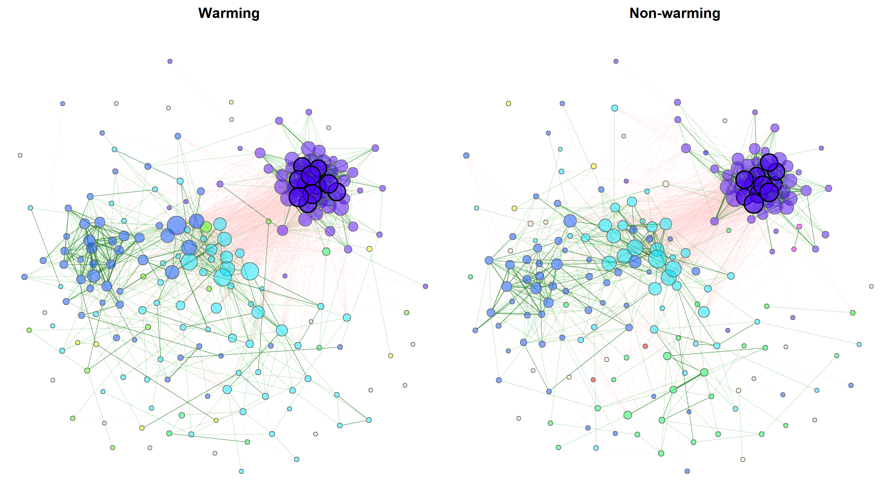
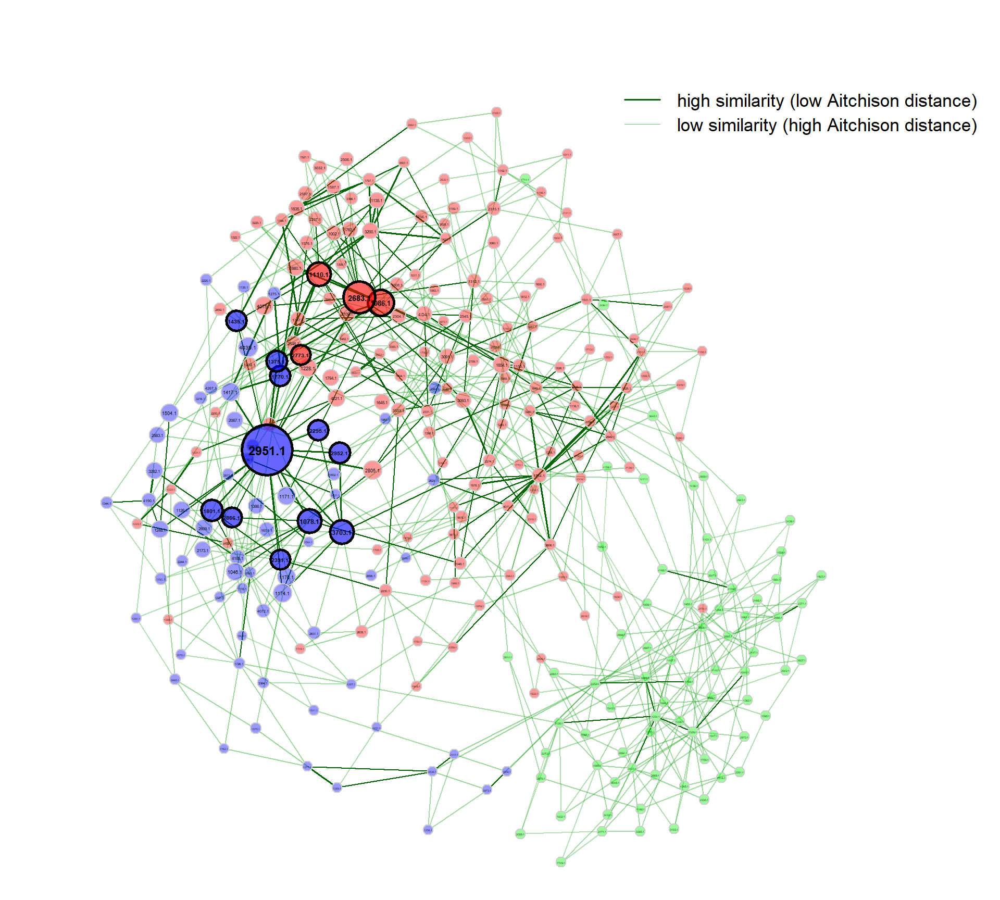

# NetCoMi 

[](https://zenodo.org/badge/latestdoi/259906607)

NetCoMi (**Net**work **Co**nstruction and Comparison for **Mi**crobiome
Data) provides functionality for constructing, analyzing, and comparing
networks suitable for the application on microbial compositional data.
The R package implements the workflow proposed in

Stefanie Peschel, Christian L Müller, Erika von Mutius, Anne-Laure
Boulesteix, Martin Depner (2020). [NetCoMi: network construction and
comparison for microbiome data in
R](https://academic.oup.com/bib/advance-article/doi/10.1093/bib/bbaa290/6017455).
*Briefings in Bioinformatics*, bbaa290.
<https://doi.org/10.1093/bib/bbaa290>.

NetCoMi allows its users to construct, analyze, and compare microbial
association or dissimilarity networks in a fast and reproducible manner.
Starting with a read count matrix originating from a sequencing process,
the pipeline includes a wide range of existing methods for treating
zeros in the data, normalization, computing microbial associations or
dissimilarities, and sparsifying the resulting association/
dissimilarity matrix. These methods can be combined in a modular fashion
to generate microbial networks. NetCoMi can either be used for
constructing, analyzing and visualizing a single network, or for
comparing two networks in a graphical as well as a quantitative manner,
including statistical tests. The package furthermore offers
functionality for constructing differential networks, where only
differentially associated taxa are connected.

<!-- -->

> Exemplary network comparison using soil microbiome data ([‘soilrep’
> data from phyloseq
> package](https://github.com/joey711/phyloseq/blob/master/data/soilrep.RData)).
> Microbial associations are compared between the two experimantal
> settings ‘warming’ and ‘non-warming’ using the same layout in both
> groups.

## Overview of methods included in NetCoMi

Here is an overview of methods available for network construction,
together with some information on the implementation in R:

**Association measures:**

-   Pearson coefficient
    ([`cor()`](https://www.rdocumentation.org/packages/stats/versions/3.6.2/topics/cor)
    from `stats` package)
-   Spearman coefficient
    ([`cor()`](https://www.rdocumentation.org/packages/stats/versions/3.6.2/topics/cor)
    from `stats` package)
-   Biweight Midcorrelation
    [`bicor()`](https://rdrr.io/cran/WGCNA/man/bicor.html) from `WGCNA`
    package
-   SparCC
    ([`sparcc()`](https://rdrr.io/github/zdk123/SpiecEasi/man/sparcc.html)
    from `SpiecEasi` package)
-   CCLasso ([R code on GitHub](https://github.com/huayingfang/CCLasso))
-   CCREPE
    ([`ccrepe`](https://bioconductor.org/packages/release/bioc/html/ccrepe.html)
    package)
-   SpiecEasi ([`SpiecEasi`](https://github.com/zdk123/SpiecEasi)
    package)
-   SPRING ([`SPRING`](https://github.com/GraceYoon/SPRING) package)
-   gCoda ([R code on GitHub](https://github.com/huayingfang/gCoda))
-   propr
    ([`propr`](https://cran.r-project.org/web/packages/propr/index.html)
    package)

**Dissimilarity measures:**

-   Euclidean distance
    ([`vegdist()`](https://www.rdocumentation.org/packages/vegan/versions/2.4-2/topics/vegdist)
    from `vegan` package)
-   Bray-Curtis dissimilarity
    ([`vegdist()`](https://www.rdocumentation.org/packages/vegan/versions/2.4-2/topics/vegdist)
    from `vegan` package)
-   Kullback-Leibler divergence (KLD)
    ([`KLD()`](https://rdrr.io/cran/LaplacesDemon/man/KLD.html) from
    `LaplacesDemon` package)
-   Jeffrey divergence (own code using
    [`KLD()`](https://rdrr.io/cran/LaplacesDemon/man/KLD.html) from
    `LaplacesDemon` package)
-   Jensen-Shannon divergence (own code using
    [`KLD()`](https://rdrr.io/cran/LaplacesDemon/man/KLD.html) from
    `LaplacesDemon` package)
-   Compositional KLD (own implementation following \[Martín-Fernández
    et al., 1999\])
-   Aitchison distance
    ([`vegdist()`](https://www.rdocumentation.org/packages/vegan/versions/2.4-2/topics/vegdist)
    and [`clr()`](https://rdrr.io/github/zdk123/SpiecEasi/man/clr.html)
    from `SpiecEasi` package)

**Methods for zero replacement:**

-   Adding a predefined pseudo count
-   Multiplicative replacement
    ([`multRepl`](https://rdrr.io/cran/zCompositions/man/multRepl.html)
    from `zCompositions` package)
-   Modified EM alr-algorithm
    ([`lrEM`](https://rdrr.io/cran/zCompositions/man/lrEM.html) from
    `zCompositions` package)
-   Bayesian-multiplicative replacement
    ([`cmultRepl`](https://rdrr.io/cran/zCompositions/man/cmultRepl.html)
    from `zCompositions` package)

**Normalization methods:**

-   Total Sum Scaling (TSS) (own implementation)
-   Cumulative Sum Scaling (CSS) ([`cumNormMat`]() from `metagenomeSeq`
    package)
-   Common Sum Scaling (COM) (own implementation)
-   Rarefying ([`rrarefy`]() from `vegan` package)
-   Variance Stabilizing Transformation (VST)
    ([`varianceStabilizingTransformation`]() from `DESeq2` package)
-   Centered log-ratio (clr) transformation
    ([`clr()`](https://rdrr.io/github/zdk123/SpiecEasi/man/clr.html)
    from `SpiecEasi` package))

TSS, CSS, COM, VST, and the clr transformation are described in \[Badri
et al., 2020\].

## Installation

``` r
#install.packages("devtools")

devtools::install_github("stefpeschel/NetCoMi", dependencies = TRUE,
                         repos = c("https://cloud.r-project.org/",
                                   BiocManager::repositories()))
```

If there are any errors during installation, please install the missing
dependencies manually.

Packages that are optionally required in certain settings are not
installed together with NetCoMi. These can be automatically installed
using:

``` r
installNetCoMiPacks()

# Please check:
?installNetCoMiPacks()
```

If not installed via `installNetCoMiPacks()`, the required package is
installed by the respective NetCoMi function when needed.

## Basic Usage

We use the American Gut data from
[`SpiecEasi`](https://github.com/zdk123/SpiecEasi) package to look at
some examples of how NetCoMi is applied. NetCoMi’s main functions are
`netConstruct()` for network construction, `netAnalyze()` for network
analysis, and `netCompare()` for network comparison. As you will see in
the following, these three functions must be executed in the
aforementioned order. A further function is `diffnet()` for constructing
a differential association network. `diffnet()` must be applied to the
object returned from `netConstruct()`.

First of all, we load NetCoMi and the data from American Gut Project
(provided by [`SpiecEasi`](https://github.com/zdk123/SpiecEasi), which
is automatically loaded together with NetCoMi).

``` r
library(NetCoMi)
data("amgut1.filt")
data("amgut2.filt.phy")
```

### Single network with SPRING as association measure

**Network construction and analysis**

We firstly construct a single association network using the
[SPRING](https://github.com/GraceYoon/SPRING) approach for estimating
associations (conditional dependence) between OTUs.

The data are filtered within `netConstruct()` as follows:

-   Only samples with a total number of reads of at least 1000 are
    included (argument `filtSamp`).
-   Only the 100 taxa with highest frequency are included (argument
    `filtTax`).

`measure` defines the association or dissimilarity measure, which is
`"spring"` in our case. Additional arguments are passed to `SPRING()`
via `measurePar`. `nlambda` and `rep.num` are set to 10 for a decreased
execution time, but should be higher for real data.

Normalization as well as zero handling is performed internally in
`SPRING()`. Hence, we set `normMethod` and `zeroMethod` to `"none"`.

We furthermore set `sparsMethod` to `"none"` because `SPRING` returns a
sparse network where no additional sparsification step is necessary.

We use the “signed” method for transforming associations into
dissimilarities (argument `dissFunc`). In doing so, strongly negatively
associated taxa have a high dissimilarity and, in turn, a low
similarity, which corresponds to edge weights in the network plot.

The `verbose` argument is set to 3 so that all messages generated by
`netConstruct()` as well as messages of external functions are printed.

``` r
net_single <- netConstruct(amgut1.filt,
                           filtTax = "highestFreq",
                           filtTaxPar = list(highestFreq = 100),
                           filtSamp = "totalReads",
                           filtSampPar = list(totalReads = 1000),
                           measure = "spring",
                           measurePar = list(nlambda=10, 
                                             rep.num=10),
                           normMethod = "none", 
                           zeroMethod = "none",
                           sparsMethod = "none", 
                           dissFunc = "signed",
                           verbose = 3,
                           seed = 123456)
```

    ## Data filtering ...

    ## 27 taxa removed.

    ## 100 taxa and 289 samples remaining.

    ## 
    ## Calculate 'spring' associations ...

    ## The input is identified as the covariance matrix.
    ## Conducting Meinshausen & Buhlmann graph estimation (mb)....done
    ## The input is identified as the covariance matrix.
    ## Conducting Meinshausen & Buhlmann graph estimation (mb)....done
    ## The input is identified as the covariance matrix.
    ## Conducting Meinshausen & Buhlmann graph estimation (mb)....done
    ## The input is identified as the covariance matrix.
    ## Conducting Meinshausen & Buhlmann graph estimation (mb)....done
    ## The input is identified as the covariance matrix.
    ## Conducting Meinshausen & Buhlmann graph estimation (mb)....done
    ## The input is identified as the covariance matrix.
    ## Conducting Meinshausen & Buhlmann graph estimation (mb)....done
    ## The input is identified as the covariance matrix.
    ## Conducting Meinshausen & Buhlmann graph estimation (mb)....done
    ## The input is identified as the covariance matrix.
    ## Conducting Meinshausen & Buhlmann graph estimation (mb)....done
    ## The input is identified as the covariance matrix.
    ## Conducting Meinshausen & Buhlmann graph estimation (mb)....done
    ## The input is identified as the covariance matrix.
    ## Conducting Meinshausen & Buhlmann graph estimation (mb)....done
    ## The input is identified as the covariance matrix.
    ## Conducting Meinshausen & Buhlmann graph estimation (mb)....done

    ## Done.

**Analyzing the constructed network**

NetCoMi’s `netAnalyze()` function is used for analyzing the constructed
network(s).

Here, `centrLCC` is set to `TRUE` meaning that centralities are
calculated only for nodes in the largest connected component (LCC).

Clusters are identified using greedy modularity optimization (by
`cluster_fast_greedy()` from [`igraph`](https://igraph.org/r/) package).

Hubs are nodes with an eigenvector centrality value above the empirical
95% quantile of all eigenvector centralities in the network (argument
`hubPar`).

`weightDeg` and `normDeg` are set to `FALSE` so that the degree of a
node is simply defined as number of nodes that are adjacent to the node.

``` r
props_single <- netAnalyze(net_single, 
                           centrLCC = TRUE,
                           clustMethod = "cluster_fast_greedy",
                           hubPar = "eigenvector",
                           weightDeg = FALSE, normDeg = FALSE)

#?summary.microNetProps
summary(props_single, numbNodes = 5L)
```

    ## 
    ## Component sizes
    ## ```````````````         
    ## size: 100
    ##    #:   1
    ## ______________________________
    ## Global network properties
    ## `````````````````````````
    ##                                  
    ## Number of components      1.00000
    ## Clustering coefficient    0.32020
    ## Moduarity                 0.51909
    ## Positive edge percentage 92.01278
    ## Edge density              0.06323
    ## Natural connectivity      0.01454
    ## Vertex connectivity       1.00000
    ## Edge connectivity         1.00000
    ## Average dissimilarity*    0.97984
    ## Average path length**     2.22537
    ## 
    ##  *Dissimilarity = 1 - edge weight
    ## **Path length: Units with average dissimilarity
    ## 
    ## ______________________________
    ## Clusters
    ## - In the whole network
    ## - Algorithm: cluster_fast_greedy
    ## ```````````````````````````````` 
    ##                       
    ## name:  1  2  3  4  5 6
    ##    #: 15 25 14 21 20 5
    ## 
    ## ______________________________
    ## Hubs
    ## - In alphabetical/numerical order
    ## - Based on empirical quantiles of centralities
    ## ```````````````````````````````````````````````       
    ##  189396
    ##  191687
    ##  293896
    ##  364563
    ##  544358
    ## 
    ## ______________________________
    ## Centrality measures
    ## - In decreasing order
    ## - Computed for the complete network
    ## ````````````````````````````````````
    ## Degree (unnormalized):
    ##          
    ## 293896 15
    ## 544358 14
    ## 174012 13
    ## 364563 12
    ## 311477 12
    ## 
    ## Betweenness centrality (normalized):
    ##               
    ## 175617 0.14533
    ## 175537 0.11833
    ## 165261 0.10142
    ## 185451 0.09462
    ## 268332 0.08493
    ## 
    ## Closeness centrality (normalized):
    ##               
    ## 544358 0.71315
    ## 293896 0.69119
    ## 191687 0.67098
    ## 311477 0.66954
    ## 174012 0.66699
    ## 
    ## Eigenvector centrality (normalized):
    ##               
    ## 293896 1.00000
    ## 191687 0.87429
    ## 364563 0.86119
    ## 189396 0.83855
    ## 544358 0.81202

**Visualizing the network**

We use the determined clusters as node colors and scale the node sizes
according to the node’s eigenvector centrality.

``` r
# help page
?plot.microNetProps
```

``` r
p <- plot(props_single, 
          nodeColor = "cluster", 
          nodeSize = "eigenvector",
          title1 = "Network on OTU level with SPRING associations", 
          showTitle = TRUE,
          cexTitle = 2.3)

legend(0.7, 1.1, cex = 2.2, title = "estimated association:",
       legend = c("+","-"), lty = 1, lwd = 3, col = c("#009900","red"), 
       bty = "n", horiz = TRUE)
```

<!-- -->

Note that edge weights are (non-negative) similarities, however, the
edges belonging to negative estimated associations are colored in red by
default (`negDiffCol = TRUE`).

By default, a different transparency value is added to edges with an
absolute weight below and above the `cut` value (arguments
`edgeTranspLow` and `edgeTranspHigh`). The determined `cut` value can be
read out as follows:

``` r
p$q1$Arguments$cut
```

    ## [1] 0.3211104

### Single network with Pearson correlation as association measure

Let’s construct another network using Pearson’s correlation coefficient
as association measure. The input is now a `phyloseq` object.

Since Pearson correlations may lead to compositional effects when
applied to sequencing data, we use the clr transformation as
normalization method. Zero treatment is necessary in this case.

A threshold of 0.3 is used as sparsification method, so that only OTUs
with an absolute correlation greater than or equal to 0.3 are connected.

``` r
net_single2 <- netConstruct(amgut2.filt.phy,  
                            measure = "pearson",
                            normMethod = "clr", 
                            zeroMethod = "multRepl",
                            sparsMethod = "threshold", 
                            thresh = 0.3,
                            verbose = 3)
```

    ## 2 rows with zero sum removed.

    ## 138 taxa and 294 samples remaining.

    ## 
    ## Zero treatment:

    ## Execute multRepl() ... Done.
    ## 
    ## Normalization:
    ## Execute clr(){SpiecEasi} ... Done.
    ## 
    ## Calculate 'pearson' associations ... Done.
    ## 
    ## Sparsify associations via 'threshold' ... Done.

Network analysis and plotting:

``` r
props_single2 <- netAnalyze(net_single2, clustMethod = "cluster_fast_greedy")

plot(props_single2, 
     nodeColor = "cluster", 
     nodeSize = "eigenvector",
     title1 = "Network on OTU level with Pearson correlations", 
     showTitle = TRUE,
     cexTitle = 2.3)

legend(0.7, 1.1, cex = 2.2, title = "estimated correlation:", 
       legend = c("+","-"), lty = 1, lwd = 3, col = c("#009900","red"), 
       bty = "n", horiz = TRUE)
```

<!-- -->

Let’s improve the visualization a bit by changing the following
arguments:

-   `repulsion = 0.8`: Place the nodes further apart
-   `rmSingles = TRUE`: Single nodes are removed
-   `labelScale = FALSE` and `cexLabels = 1.6`: All labels have equal
    size and are enlarged to improve readability of small node’s labels
-   `nodeSizeSpread = 3` (default is 4): Node sizes are more similar if
    the value is decreased. This argument (in combination with
    `cexNodes`) is useful to enlarge small nodes while keeping the size
    of big nodes.

``` r
plot(props_single2, 
     nodeColor = "cluster", 
     nodeSize = "eigenvector",
     repulsion = 0.8,
     rmSingles = TRUE,
     labelScale = FALSE,
     cexLabels = 1.6,
     nodeSizeSpread = 3,
     cexNodes = 2,
     title1 = "Network on OTU level with Pearson correlations", 
     showTitle = TRUE,
     cexTitle = 2.3)

legend(0.7, 1.1, cex = 2.2, title = "estimated correlation:",
       legend = c("+","-"), lty = 1, lwd = 3, col = c("#009900","red"),
       bty = "n", horiz = TRUE)
```

<!-- -->

### Single association network on genus level

We now construct a further network, where OTUs are agglomerated to
genera.

``` r
# Agglomerate to genus level
amgut_genus <- phyloseq::tax_glom(amgut2.filt.phy, taxrank = "Rank6")
taxtab <- amgut_genus@tax_table@.Data

# Find undefined taxa (in this data set, unknowns occur only up to Rank5)
miss_f <- which(taxtab[, "Rank5"] == "f__")
miss_g <- which(taxtab[, "Rank6"] == "g__")

# Number unspecified genera
taxtab[miss_f, "Rank5"] <- paste0("f__", 1:length(miss_f))
taxtab[miss_g, "Rank6"] <- paste0("g__", 1:length(miss_g))

# Find duplicate genera
dupl_g <- which(duplicated(taxtab[, "Rank6"]) |
                  duplicated(taxtab[, "Rank6"], fromLast = TRUE))

for(i in seq_along(taxtab)){
  # The next higher non-missing rank is assigned to unspecified genera
  if(i %in% miss_f && i %in% miss_g){
    taxtab[i, "Rank6"] <- paste0(taxtab[i, "Rank6"], "(", taxtab[i, "Rank4"], ")")
  } else if(i %in% miss_g){
    taxtab[i, "Rank6"] <- paste0(taxtab[i, "Rank6"], "(", taxtab[i, "Rank5"], ")")
  }
  
  # Family names are added to duplicate genera
  if(i %in% dupl_g){
    taxtab[i, "Rank6"] <- paste0(taxtab[i, "Rank6"], "(", taxtab[i, "Rank5"], ")")
  }
}

amgut_genus@tax_table@.Data <- taxtab
rownames(amgut_genus@otu_table@.Data) <- taxtab[, "Rank6"]

# Network construction and analysis
net_single3 <- netConstruct(amgut_genus, 
                            measure = "pearson",
                            zeroMethod = "multRepl",
                            normMethod = "clr", 
                            sparsMethod = "threshold", 
                            thresh = 0.3, 
                            verbose = 3)
```

    ## 2 rows with zero sum removed.

    ## 43 taxa and 294 samples remaining.

    ## 
    ## Zero treatment:

    ## Execute multRepl() ... Done.
    ## 
    ## Normalization:
    ## Execute clr(){SpiecEasi} ... Done.
    ## 
    ## Calculate 'pearson' associations ... Done.
    ## 
    ## Sparsify associations via 'threshold' ... Done.

``` r
props_single3 <- netAnalyze(net_single3, clustMethod = "cluster_fast_greedy")
```

**Network plots**

Modifications:

-   Fruchterman-Reingold layout algorithm from `igraph` package used
    (passed to `plot` as matrix)
-   Shortened labels
-   Fixed node sizes, where hubs are enlarged
-   Node color is gray for all nodes (transparancy is lower for hub
    nodes by default)

``` r
# Compute layout
graph3 <- igraph::graph_from_adjacency_matrix(net_single3$adjaMat1, weighted = TRUE)
lay_fr <- igraph::layout_with_fr(graph3)
# Note that row names of the layout matrix must match the node names
rownames(lay_fr) <- rownames(net_single3$adjaMat1)

plot(props_single3,
     layout = lay_fr,
     shortenLabels = "simple",
     labelLength = 10,
     nodeSize = "fix",
     nodeColor = "gray",
     cexNodes = 0.8,
     cexHubs = 1.1,
     cexLabels = 1.2,
     title1 = "Network on genus level with Pearson correlations", 
     showTitle = TRUE,
     cexTitle = 2.3)

legend(0.7, 1.1, cex = 2.2, title = "estimated correlation:",
       legend = c("+","-"), lty = 1, lwd = 3, col = c("#009900","red"), 
       bty = "n", horiz = TRUE)
```

<!-- -->

Since the above visualization is obviously not optimal, we make further
adjustments:

-   This time, the Fruchterman-Reingold layout algorithm is computed
    within the plot function and thus applied to the “reduced” network
    without singletons
-   Leading patterns "g\_\_" are removed
-   Labels are not scaled to node sizes
-   Single nodes are removed
-   Node sizes are scaled to the column sums of clr-transformed data
-   Node colors represent the determined clusters
-   Border color of hub nodes is changed from black to darkgray
-   Label size of hubs is enlarged

``` r
set.seed(123456)
graph3 <- igraph::graph_from_adjacency_matrix(net_single3$adjaMat1, weighted = TRUE)
lay_fr <- igraph::layout_with_fr(graph3)
rownames(lay_fr) <- rownames(net_single3$adjaMat1)

plot(props_single3,
     layout = "layout_with_fr",
     shortenLabels = "simple",
     labelLength = 10,
     charToRm = "g__",
     labelScale = FALSE,
     rmSingles = TRUE,
     nodeSize = "clr",
     nodeColor = "cluster",
     hubBorderCol = "darkgray",
     cexNodes = 2,
     cexLabels = 1.5,
     cexHubLabels = 2,
     title1 = "Network on genus level with Pearson correlations", 
     showTitle = TRUE,
     cexTitle = 2.3)

legend(0.7, 1.1, cex = 2.2, title = "estimated correlation:",
       legend = c("+","-"), lty = 1, lwd = 3, col = c("#009900","red"), 
       bty = "n", horiz = TRUE)
```

<!-- -->

Let’s check whether the largest nodes are actually those with highest
column sums in the matrix with normalized counts returned from
`netConstruct()`.

``` r
sort(colSums(net_single3$normCounts1), decreasing = TRUE)[1:10]
```

    ##              g__Bacteroides               g__Klebsiella 
    ##                   1200.7971                   1137.4928 
    ##         g__Faecalibacterium      g__5(o__Clostridiales) 
    ##                    708.0877                    549.2647 
    ##    g__2(f__Ruminococcaceae)    g__3(f__Lachnospiraceae) 
    ##                    502.1889                    493.7558 
    ## g__6(f__Enterobacteriaceae)                g__Roseburia 
    ##                    363.3841                    333.8737 
    ##          g__Parabacteroides              g__Coprococcus 
    ##                    328.0495                    274.4082

In order to further improve our plot, we use the following
modifications:

-   This time, we choose the “spring” layout as part of `qgraph()` (the
    function is generally used for network plotting in NetCoMi)
-   A repulsion value below 1 places the nodes further apart
-   Labels are not shortened anymore
-   Nodes (bacteria on genus level) are colored according to the
    respective phylum
-   Edges representing positive associations are colored in blue,
    negative ones in orange (just to give an example for alternative
    edge coloring)
-   Transparency is increased for edges with high weight to improve the
    readability of node labels

``` r
# Get phyla names from the taxonomic table created before
phyla <- as.factor(gsub("p__", "", taxtab[, "Rank2"]))
names(phyla) <- taxtab[, "Rank6"]
#table(phyla)

# Define phylum colors
phylcol <- c("cyan", "blue3", "red", "lawngreen", "yellow", "deeppink")

plot(props_single3,
     layout = "spring",
     repulsion = 0.84,
     shortenLabels = "none",
     charToRm = "g__",
     labelScale = FALSE,
     rmSingles = TRUE,
     nodeSize = "clr",
     nodeSizeSpread = 4,
     nodeColor = "feature", 
     featVecCol = phyla, 
     colorVec =  phylcol,
     posCol = "darkturquoise", 
     negCol = "orange",
     edgeTranspLow = 0,
     edgeTranspHigh = 40,
     cexNodes = 2,
     cexLabels = 2,
     cexHubLabels = 2.5,
     title1 = "Network on genus level with Pearson correlations", 
     showTitle = TRUE,
     cexTitle = 2.3)

# Colors used in the legend should be equally transparent as in the plot
phylcol_transp <- NetCoMi:::colToTransp(phylcol, 60)

legend(-1.2, 1.2, cex = 2, pt.cex = 2.5, title = "Phylum:", 
       legend=levels(phyla), col = phylcol_transp, bty = "n", pch = 16) 

legend(0.7, 1.1, cex = 2.2, title = "estimated correlation:",
       legend = c("+","-"), lty = 1, lwd = 3, col = c("darkturquoise","orange"), 
       bty = "n", horiz = TRUE)
```

<!-- -->

### Network comparison

Now let’s look how two networks are compared using NetCoMi.

**Network construction**

The covariate `"SEASONAL_ALLERGIES`" is used for splitting the data set
into two groups. The [`metagMisc`](https://github.com/vmikk/metagMisc)
package offers a function for splitting phyloseq objects according to a
variable. The two resulting phyloseq objects (we ignore the group
‘None’) can directly be passed to NetCoMi.

We select the 50 nodes with highest variance to get smaller networks.

``` r
# devtools::install_github("vmikk/metagMisc")

# Split the phyloseq object into two groups
amgut_split <- metagMisc::phyloseq_sep_variable(amgut2.filt.phy, 
                                                "SEASONAL_ALLERGIES")

# Network construction
net_season <- netConstruct(data = amgut_split$no, 
                           data2 = amgut_split$yes,  
                           filtTax = "highestVar",
                           filtTaxPar = list(highestVar = 50),
                           measure = "spring",
                           measurePar = list(nlambda=10, 
                                             rep.num=10),
                           normMethod = "none", 
                           zeroMethod = "none",
                           sparsMethod = "none", 
                           dissFunc = "signed",
                           verbose = 3,
                           seed = 123456)
```

    ## Data filtering ...

    ## 95 taxa removed in each data set.

    ## 1 rows with zero sum removed in group 1.

    ## 1 rows with zero sum removed in group 2.

    ## 43 taxa and 162 samples remaining in group 1.

    ## 43 taxa and 120 samples remaining in group 2.

    ## 
    ## Calculate 'spring' associations ...

    ## The input is identified as the covariance matrix.
    ## Conducting Meinshausen & Buhlmann graph estimation (mb)....done
    ## The input is identified as the covariance matrix.
    ## Conducting Meinshausen & Buhlmann graph estimation (mb)....done
    ## The input is identified as the covariance matrix.
    ## Conducting Meinshausen & Buhlmann graph estimation (mb)....done
    ## The input is identified as the covariance matrix.
    ## Conducting Meinshausen & Buhlmann graph estimation (mb)....done
    ## The input is identified as the covariance matrix.
    ## Conducting Meinshausen & Buhlmann graph estimation (mb)....done
    ## The input is identified as the covariance matrix.
    ## Conducting Meinshausen & Buhlmann graph estimation (mb)....done
    ## The input is identified as the covariance matrix.
    ## Conducting Meinshausen & Buhlmann graph estimation (mb)....done
    ## The input is identified as the covariance matrix.
    ## Conducting Meinshausen & Buhlmann graph estimation (mb)....done
    ## The input is identified as the covariance matrix.
    ## Conducting Meinshausen & Buhlmann graph estimation (mb)....done
    ## The input is identified as the covariance matrix.
    ## Conducting Meinshausen & Buhlmann graph estimation (mb)....done
    ## The input is identified as the covariance matrix.
    ## Conducting Meinshausen & Buhlmann graph estimation (mb)....done

    ## Done.
    ## 
    ## Calculate associations in group 2 ...

    ## The input is identified as the covariance matrix.
    ## Conducting Meinshausen & Buhlmann graph estimation (mb)....done
    ## The input is identified as the covariance matrix.
    ## Conducting Meinshausen & Buhlmann graph estimation (mb)....done
    ## The input is identified as the covariance matrix.
    ## Conducting Meinshausen & Buhlmann graph estimation (mb)....done
    ## The input is identified as the covariance matrix.
    ## Conducting Meinshausen & Buhlmann graph estimation (mb)....done
    ## The input is identified as the covariance matrix.
    ## Conducting Meinshausen & Buhlmann graph estimation (mb)....done
    ## The input is identified as the covariance matrix.
    ## Conducting Meinshausen & Buhlmann graph estimation (mb)....done
    ## The input is identified as the covariance matrix.
    ## Conducting Meinshausen & Buhlmann graph estimation (mb)....done
    ## The input is identified as the covariance matrix.
    ## Conducting Meinshausen & Buhlmann graph estimation (mb)....done
    ## The input is identified as the covariance matrix.
    ## Conducting Meinshausen & Buhlmann graph estimation (mb)....done
    ## The input is identified as the covariance matrix.
    ## Conducting Meinshausen & Buhlmann graph estimation (mb)....done
    ## The input is identified as the covariance matrix.
    ## Conducting Meinshausen & Buhlmann graph estimation (mb)....done

    ## Done.

Alternatively, a group vector could be passed to `group`, according to
which the data set is split into two groups:

``` r
# netConstruct() expects samples in rows
countMat <- t(amgut2.filt.phy@otu_table@.Data)
group_vec <- phyloseq::get_variable(amgut2.filt.phy, "SEASONAL_ALLERGIES")

# Select the two groups of interest (level "none" is excluded)
sel <- which(group_vec %in% c("no", "yes"))
group_vec <- group_vec[sel]
countMat <- countMat[sel, ]

net_season <- netConstruct(countMat, 
                           group = group_vec, 
                           filtTax = "highestVar",
                           filtTaxPar = list(highestVar = 50),
                           measure = "spring",
                           measurePar = list(nlambda=10, 
                                             rep.num=10),
                           normMethod = "none", 
                           zeroMethod = "none",
                           sparsMethod = "none", 
                           dissFunc = "signed",
                           verbose = 3,
                           seed = 123456)
```

**Network analysis**

The object returned from `netConstruct()` containing both networks is
again passed to `netAnalyze()`. Network properties are computed for both
networks simultaneously.

To demonstrate further functionalities of `netAnalyze()`, we play around
with the available arguments, even if the chosen setting might not be
optimal.

-   `centrLCC = FALSE`: Centralities are calculated for all nodes (not
    only for the largest connected component).
-   `avDissIgnoreInf = TRUE`: Nodes with an infinite dissimilarity are
    ignored when calculating the average dissimilarity.
-   `sPathNorm = FALSE`: Shortest paths are not normalized by average
    dissimilarity.
-   `hubPar = c("degree", "between", "closeness")`: Hubs are nodes with
    highest degree, betweenness, and closeness centrality at the same
    time.
-   `lnormFit = TRUE` and `hubQuant = 0.9`: A log-normal distribution is
    fitted to the centrality values to identify nodes with “highest”
    centrality values. Here, a node is identified as hub if for each of
    the three centrality measures, the node’s centrality value is above
    the 90% quantile of the fitted log-normal distribution.
-   The non-normalized centralities are used for all four measures.

**Note! The arguments must be set carefully, depending on the research
questions. NetCoMi’s default values are not generally preferable in all
practical cases!**

``` r
props_season <- netAnalyze(net_season, 
                           centrLCC = FALSE,
                           avDissIgnoreInf = TRUE,
                           sPathNorm = FALSE,
                           clustMethod = "cluster_fast_greedy",
                           hubPar = c("degree", "between", "closeness"),
                           hubQuant = 0.9,
                           lnormFit = TRUE,
                           normDeg = FALSE,
                           normBetw = FALSE,
                           normClose = FALSE,
                           normEigen = FALSE)

summary(props_season)
```

    ## 
    ## Component sizes
    ## ```````````````
    ## Group 1:            
    ## size: 31 8 1
    ##    #:  1 1 4
    ## 
    ## Group 2:          
    ## size: 41 1
    ##    #:  1 2
    ## ______________________________
    ## Global network properties
    ## `````````````````````````
    ## Largest connected component (LCC):
    ##                          group '1' group '2'
    ## Relative LCC size          0.72093   0.95349
    ## Clustering coefficient     0.27184   0.29563
    ## Moduarity                  0.51794   0.54832
    ## Positive edge percentage 100.00000 100.00000
    ## Edge density               0.11183   0.09512
    ## Natural connectivity       0.04296   0.03257
    ## Vertex connectivity        1.00000   1.00000
    ## Edge connectivity          1.00000   1.00000
    ## Average dissimilarity*     0.68091   0.67853
    ## Average path length**      2.23414   2.49352
    ## 
    ## Whole network:
    ##                          group '1' group '2'
    ## Number of components       6.00000   3.00000
    ## Clustering coefficient     0.31801   0.29563
    ## Moduarity                  0.62749   0.54832
    ## Positive edge percentage 100.00000 100.00000
    ## Edge density               0.06977   0.08638
    ## Natural connectivity       0.02979   0.03072
    ## 
    ##  *Dissimilarity = 1 - edge weight
    ## **Path length: Sum of dissimilarities along the path
    ## 
    ## ______________________________
    ## Clusters
    ## - In the whole network
    ## - Algorithm: cluster_fast_greedy
    ## ```````````````````````````````` 
    ## group '1':                 
    ## name: 0  1  2 3 4
    ##    #: 4 10 13 8 8
    ## 
    ## group '2':                  
    ## name: 0 1  2 3 4 5
    ##    #: 2 6 11 8 8 8
    ## 
    ## ______________________________
    ## Hubs
    ## - In alphabetical/numerical order
    ## - Based on log-normal quantiles of centralities
    ## ```````````````````````````````````````````````
    ##  group '1' group '2'
    ##               322235
    ## 
    ## ______________________________
    ## Centrality measures
    ## - In decreasing order
    ## - Computed for the complete network
    ## ````````````````````````````````````
    ## Degree (unnormalized):
    ##         group '1' group '2'
    ##  322235         7         9
    ##  364563         7         5
    ##  259569         7         5
    ##  184983         6         5
    ##    9715         5         4
    ##            ______    ______
    ##  322235         7         9
    ##  363302         4         9
    ##  158660         3         6
    ##   90487         3         5
    ##  188236         4         5
    ## 
    ## Betweenness centrality (unnormalized):
    ##         group '1' group '2'
    ##  364563       148        82
    ##  188236       144        87
    ##  259569       122        39
    ##  331820       115         8
    ##  322235       106       226
    ##            ______    ______
    ##  158660         0       317
    ##  470239         5       256
    ##   10116         0       233
    ##  322235       106       226
    ##  326792         0       161
    ## 
    ## Closeness centrality (unnormalized):
    ##         group '1' group '2'
    ##  364563  22.67516  25.82886
    ##  259569  22.19619  23.95399
    ##  322235   22.1629   30.0221
    ##  188236   21.1083  26.37517
    ##  184983   20.0581  22.58796
    ##            ______    ______
    ##  322235   22.1629   30.0221
    ##  158660  17.64634  27.65421
    ##  363302  17.27059  27.61001
    ##  326792  17.95234  26.47248
    ##  188236   21.1083  26.37517
    ## 
    ## Eigenvector centrality (unnormalized):
    ##         group '1' group '2'
    ##  364563   0.30442    0.2137
    ##  184983   0.29042   0.26935
    ##  188236    0.2392   0.23412
    ##  516022   0.23484   0.14094
    ##  190464   0.22311   0.21337
    ##            ______    ______
    ##  363302   0.21617   0.38157
    ##  322235   0.14538   0.29676
    ##  194648   0.17436   0.28061
    ##  184983   0.29042   0.26935
    ##  188236    0.2392   0.23412

In the above setting, only one hub node (in the “Seasonal allergies”
network) has been identified.

**Visual network comparison**

First, the layout is computed separately in both groups (qgraph’s
“spring” layout in this case).

Node sizes are scaled according to the mclr-transformed data since
`SPRING` uses the mclr transformation as normalization method.

Node colors represent clusters. Note that by default, two clusters have
the same color in both groups if they have at least two nodes in common
(`sameColThresh = 2`). Set `sameClustCol` to `FALSE` to get different
cluster colors.

``` r
plot(props_season, 
     sameLayout = FALSE, 
     nodeColor = "cluster",
     nodeSize = "mclr",
     labelScale = FALSE,
     cexNodes = 1.5, 
     cexLabels = 2.5,
     cexHubLabels = 3,
     cexTitle = 3.7,
     groupNames = c("No seasonal allergies", "Seasonal allergies"),
     hubBorderCol  = "gray40")

legend("bottom", title = "estimated association:", legend = c("+","-"), 
       col = c("#009900","red"), inset = 0.02, cex = 4, lty = 1, lwd = 4, 
       bty = "n", horiz = TRUE)
```

<!-- -->

Using different layouts leads to a “nice-looking” network plot for each
group, however, it is difficult to identify group differences at a
glance.

Thus, we now use the same layout in both groups. In the following, the
layout is computed for group 1 (the left network) and taken over for
group 2.

`rmSingles` is set to `"inboth"` because only nodes that are unconnected
in both groups can be removed if the same layout is used.

``` r
plot(props_season, 
     sameLayout = TRUE, 
     layoutGroup = 1,
     rmSingles = "inboth", 
     nodeSize = "mclr", 
     labelScale = FALSE,
     cexNodes = 1.5, 
     cexLabels = 2.5,
     cexHubLabels = 3,
     cexTitle = 3.8,
     groupNames = c("No seasonal allergies", "Seasonal allergies"),
     hubBorderCol  = "gray40")

legend("bottom", title = "estimated association:", legend = c("+","-"), 
       col = c("#009900","red"), inset = 0.02, cex = 4, lty = 1, lwd = 4, 
       bty = "n", horiz = TRUE)
```

<!-- -->

In the above plot, we can see clear differences between the groups. The
OTU “322235”, for instance, is more strongly connected in the “Seasonal
allergies” group than in the group without seasonal allergies, which is
why it is a hub on the right, but not on the left.

Since simply taking over the layout of one group to the other usually
leads to an “unsightly” plot for one of the groups, NetCoMi (&gt;=
1.0.2) offers a further option (`layoutGroup = "union"`), where a union
of both layouts is used in both groups. In doing so, the nodes are
placed as optimal as possible equally for both networks.

*The idea and R code for this functionality were provided by [Christian
L. Müller](https://github.com/muellsen?tab=followers) and [Alice
Sommer](https://www.iq.harvard.edu/people/alice-sommer)*

``` r
plot(props_season, 
     sameLayout = TRUE, 
     layoutGroup = "union",
     rmSingles = "inboth", 
     nodeSize = "mclr", 
     labelScale = FALSE,
     cexNodes = 1.5, 
     cexLabels = 2.5,
     cexHubLabels = 3,
     cexTitle = 3.8,
     groupNames = c("No seasonal allergies", "Seasonal allergies"),
     hubBorderCol  = "gray40")

legend("bottom", title = "estimated association:", legend = c("+","-"), 
       col = c("#009900","red"), inset = 0.02, cex = 4, lty = 1, lwd = 4, 
       bty = "n", horiz = TRUE)
```

<!-- -->

**Quantitative network comparison**

Since runtime is considerably increased if permutation tests are
performed, we set the `permTest` parameter to `FALSE`. See the
`tutorial_createAssoPerm` file for a network comparison including
permutation tests.

``` r
comp_season <- netCompare(props_season, permTest = FALSE, verbose = FALSE)

summary(comp_season, 
        groupNames = c("No allergies", "Allergies"),
        showCentr = c("degree", "between", "closeness"), 
        numbNodes = 5)
```

    ## 
    ## Comparison of Network Properties
    ## ----------------------------------
    ## CALL: 
    ## netCompare(x = props_season, permTest = FALSE, verbose = FALSE)
    ## 
    ## ______________________________
    ## Global network properties
    ## `````````````````````````
    ## Largest connected component (LCC):
    ##                          No allergies   Allergies    difference
    ## Relative LCC size               0.721       0.953         0.233
    ## Clustering coefficient          0.272       0.296         0.024
    ## Moduarity                       0.518       0.548         0.030
    ## Positive edge percentage      100.000     100.000         0.000
    ## Edge density                    0.112       0.095         0.017
    ## Natural connectivity            0.043       0.033         0.010
    ## Vertex connectivity             1.000       1.000         0.000
    ## Edge connectivity               1.000       1.000         0.000
    ## Average dissimilarity*          0.681       0.679         0.002
    ## Average path length**           2.234       2.494         0.259
    ## 
    ## Whole network:
    ##                          No allergies   Allergies    difference
    ## Number of components            6.000       3.000         3.000
    ## Clustering coefficient          0.318       0.296         0.022
    ## Moduarity                       0.627       0.548         0.079
    ## Positive edge percentage      100.000     100.000         0.000
    ## Edge density                    0.070       0.086         0.017
    ## Natural connectivity            0.030       0.031         0.001
    ## -----
    ##  *: Dissimilarity = 1 - edge weight
    ## **Path length: Sum of dissimilarities along the path
    ## 
    ## ______________________________
    ## Jaccard index (similarity betw. sets of most central nodes)
    ## ``````````````````````````````````````````````````````````
    ##                     Jacc   P(<=Jacc)     P(>=Jacc)    
    ## degree             0.286    0.475500      0.738807    
    ## betweenness centr. 0.077    0.038537 *    0.994862    
    ## closeness centr.   0.267    0.404065      0.790760    
    ## eigenvec. centr.   0.667    0.996144      0.018758 *  
    ## hub taxa           0.000    0.666667      1.000000    
    ## -----
    ## Jaccard index ranges from 0 (compl. different) to 1 (sets equal)
    ## 
    ## ______________________________
    ## Adjusted Rand index (similarity betw. clusterings)
    ## ``````````````````````````````````````````````````
    ##    ARI       p-value
    ##  0.327             0
    ## -----
    ## ARI in [-1,1] with ARI=1: perfect agreement betw. clusterings,
    ##                    ARI=0: expected for two random clusterings
    ## p-value: two-tailed test with null hypothesis ARI=0
    ## 
    ## ______________________________
    ## Centrality measures
    ## - In decreasing order
    ## - Computed for the complete network
    ## ````````````````````````````````````
    ## Degree (unnormalized):
    ##        No allergies Allergies abs.diff.
    ## 363302            4         9         5
    ## 549871            4         0         4
    ## 469709            1         4         3
    ## 158660            3         6         3
    ## 181016            0         3         3
    ## 
    ## Betweenness centrality (unnormalized):
    ##        No allergies Allergies abs.diff.
    ## 158660            0       317       317
    ## 470239            5       256       251
    ## 10116             0       233       233
    ## 326792            0       161       161
    ## 322235          106       226       120
    ## 
    ## Closeness centrality (unnormalized):
    ##        No allergies Allergies abs.diff.
    ## 181016        0.000    22.880    22.880
    ## 361496        0.000    22.253    22.253
    ## 549871       19.787     0.000    19.787
    ## 278234        0.000    15.093    15.093
    ## 10116         7.039    20.965    13.925
    ## 
    ## _________________________________________________________
    ## Significance codes: ***: 0.001, **: 0.01, *: 0.05, .: 0.1

### Differential networks

We now build a differential association network, where two nodes are
connected if they are differentially associated between the two groups.

Due to its very short execution time, we use Pearson’s correlations for
estimating associations between OTUs.

Fisher’s z-test is applied for identifying differentially correlated
OTUs. Multiple testing adjustment is done by controlling the local false
discovery rate.

Note: `sparsMethod` is set to `"none"`, just to be able to include all
differential associations in the association network plot (see below).
However, the differential network is always based on the estimated
association matrices before sparsification (the `assoEst1` and
`assoEst2` matrices returned by `netConstruct()`).

``` r
net_season_pears <- netConstruct(data = amgut_split$no, 
                                 data2 = amgut_split$yes, 
                                 filtTax = "highestVar",
                                 filtTaxPar = list(highestVar = 50),
                                 measure = "pearson", 
                                 normMethod = "clr",
                                 sparsMethod = "none", 
                                 thresh = 0.2,
                                 verbose = 3)
```

    ## Infos about changed arguments:

    ## Zero replacement needed for clr transformation. 'multRepl' used.

    ## Data filtering ...

    ## 95 taxa removed in each data set.

    ## 1 rows with zero sum removed in group 1.

    ## 1 rows with zero sum removed in group 2.

    ## 43 taxa and 162 samples remaining in group 1.

    ## 43 taxa and 120 samples remaining in group 2.

    ## 
    ## Zero treatment in group 1:

    ## Execute multRepl() ... Done.
    ## 
    ## Zero treatment in group 2:
    ## Execute multRepl() ... Done.
    ## 
    ## Normalization in group 1:
    ## Execute clr(){SpiecEasi} ... Done.
    ## 
    ## Normalization in group 2:
    ## Execute clr(){SpiecEasi} ... Done.
    ## 
    ## Calculate 'pearson' associations ... Done.
    ## 
    ## Calculate associations in group 2 ... Done.

``` r
# Differential network construction
diff_season <- diffnet(net_season_pears,
                       diffMethod = "fisherTest", 
                       adjust = "lfdr")
```

    ## Adjust for multiple testing using 'lfdr' ... 
    ## Execute fdrtool() ...

    ## Step 1... determine cutoff point
    ## Step 2... estimate parameters of null distribution and eta0
    ## Step 3... compute p-values and estimate empirical PDF/CDF
    ## Step 4... compute q-values and local fdr

    ## Done.

``` r
# Differential network plot
plot(diff_season, 
     cexNodes = 0.8, 
     cexLegend = 3,
     cexTitle = 4,
     mar = c(2,2,8,5),
     legendGroupnames = c("group 'no'", "group 'yes'"),
     legendPos = c(0.7,1.6))
```

<!-- --> In the differential
network shown above, edge colors represent the direction of associations
in the two groups. If, for instance, two OTUs are positively associated
in group 1 and negatively associated in group 2 (such as ‘191541’ and
‘188236’), the respective edge is colored in cyan.

We also take a look at the corresponding associations by constructing
association networks that include only the differentially associated
OTUs.

``` r
props_season_pears <- netAnalyze(net_season_pears, 
                                 clustMethod = "cluster_fast_greedy",
                                 weightDeg = TRUE,
                                 normDeg = FALSE)

# Identify the differentially associated OTUs
diffmat_sums <- rowSums(diff_season$diffAdjustMat)
diff_asso_names <- names(diffmat_sums[diffmat_sums > 0])

plot(props_season_pears, 
     nodeFilter = "names",
     nodeFilterPar = diff_asso_names,
     nodeColor = "gray",
     highlightHubs = FALSE,
     sameLayout = TRUE, 
     layoutGroup = "union",
     rmSingles = FALSE, 
     nodeSize = "clr",
     edgeTranspHigh = 20,
     labelScale = FALSE,
     cexNodes = 1.5, 
     cexLabels = 3,
     cexTitle = 3.8,
     groupNames = c("No seasonal allergies", "Seasonal allergies"),
     hubBorderCol  = "gray40")

legend(-0.15,-0.7, title = "estimated correlation:", legend = c("+","-"), 
       col = c("#009900","red"), inset = 0.05, cex = 4, lty = 1, lwd = 4, 
       bty = "n", horiz = TRUE)
```

<!-- -->

We can see that the correlation between the aforementioned OTUs ‘191541’
and ‘188236’ is strongly positive in the left group and negative in the
right group.

### Dissimilarity-based Networks

If a dissimilarity measure is used for network construction, nodes are
subjects instead of OTUs. The estimated dissimilarities are transformed
into similarities, which are used as edge weights so that subjects with
a similar microbial composition are placed close together in the network
plot.

We construct a single network using Aitchison’s distance being suitable
for the application on compositional data.

Since the Aitchison distance is based on the clr-transformation, zeros
in the data need to be replaced.

The network is sparsified using the k-nearest neighbor (knn) algorithm.

``` r
net_aitchison <- netConstruct(amgut1.filt,
                              measure = "aitchison",
                              zeroMethod = "multRepl",
                              sparsMethod = "knn", 
                              kNeighbor = 3,
                              verbose = 3)
```

    ## Infos about changed arguments:

    ## Counts normalized to fractions for measure 'aitchison'.

    ## 127 taxa and 289 samples remaining.

    ## 
    ## Zero treatment:

    ## Execute multRepl() ... Done.
    ## 
    ## Normalization:
    ## Counts normalized by total sum scaling.
    ## 
    ## Calculate 'aitchison' dissimilarities ... Done.
    ## 
    ## Sparsify dissimilarities via 'knn' ... Done.

For cluster detection, we use hierarchical clustering with average
linkage. Internally, `k=3` is passed to
[`cutree()`](https://www.rdocumentation.org/packages/dendextend/versions/1.13.4/topics/cutree)
from `stats` package so that the tree is cut into 3 clusters.

``` r
props_aitchison <- netAnalyze(net_aitchison,
                              clustMethod = "hierarchical",
                              clustPar = list(method = "average", k = 3),
                              hubPar = "eigenvector")

plot(props_aitchison, 
     nodeColor = "cluster", 
     nodeSize = "eigenvector",
     hubTransp = 40,
     edgeTranspLow = 60,
     charToRm = "00000",
     mar = c(1, 3, 3, 5))

# get green color with 50% transparency
green2 <- colToTransp("#009900", 40)

legend(0.4, 1.1,
       cex = 2.2,
       legend = c("high similarity (low Aitchison distance)",
                  "low similarity (high Aitchison distance)"), 
       lty = 1, 
       lwd = c(3, 1),
       col = c("darkgreen", green2),
       bty = "n")
```

<!-- -->

In this dissimilarity-based network, hubs are interpreted as samples
with a microbial composition similar to that of many other samples in
the data set.

### Soil microbiome example

Here is the code for reproducing the network plot shown at the
beginning.

``` r
data("soilrep")

soil_warm_yes <- phyloseq::subset_samples(soilrep, warmed == "yes")
soil_warm_no  <- phyloseq::subset_samples(soilrep, warmed == "no")

net_seas_p <- netConstruct(soil_warm_yes, soil_warm_no,
                           filtTax = "highestVar",
                           filtTaxPar = list(highestVar = 500),
                           zeroMethod = "pseudo",
                           normMethod = "clr",
                           measure = "pearson",
                           verbose = 0)

netprops1 <- netAnalyze(net_seas_p, clustMethod = "cluster_fast_greedy")

nclust <- as.numeric(max(names(table(netprops1$clustering$clust1))))
col <- topo.colors(nclust)

plot(netprops1, 
     sameLayout = TRUE, 
     layoutGroup = "union", 
     colorVec = col,
     borderCol = "gray40", 
     nodeSize = "degree", 
     cexNodes = 0.9, 
     nodeSizeSpread = 3, 
     edgeTranspLow = 80, 
     edgeTranspHigh = 50,
     groupNames = c("Warming", "Non-warming"), 
     showTitle = TRUE, 
     cexTitle = 2.8,
     mar = c(1,1,3,1), 
     repulsion = 0.9, 
     labels = FALSE, 
     rmSingles = "inboth",
     nodeFilter = "clustMin", 
     nodeFilterPar = 10, 
     nodeTransp = 50, 
     hubTransp = 30)
```

## References

\[Badri et al., 2020\] Michelle Badri, Zachary D. Kurtz, Richard
Bonneau, and Christian L. Müller (2020). [Shrinkage improves estimation
of microbial associations under different normalization
methods](https://www.biorxiv.org/content/10.1101/406264v2). *bioRxiv*,
doi: 10.1101/406264.

\[Martín-Fernández et al., 1999\] Josep A Martín-Fernández, Mark J Bren,
Carles Barceló-Vidal, and Vera Pawlowsky-Glahn (1999). [A measure of
difference for compositional data based on measures of
divergence](http://ima.udg.edu/~barcelo/index_archivos/A_mesure_of_difference.pdf).
*Lippard, Næss, and Sinding-Larsen*, 211-216.)
