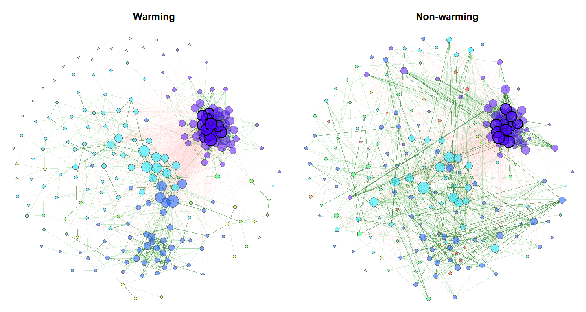
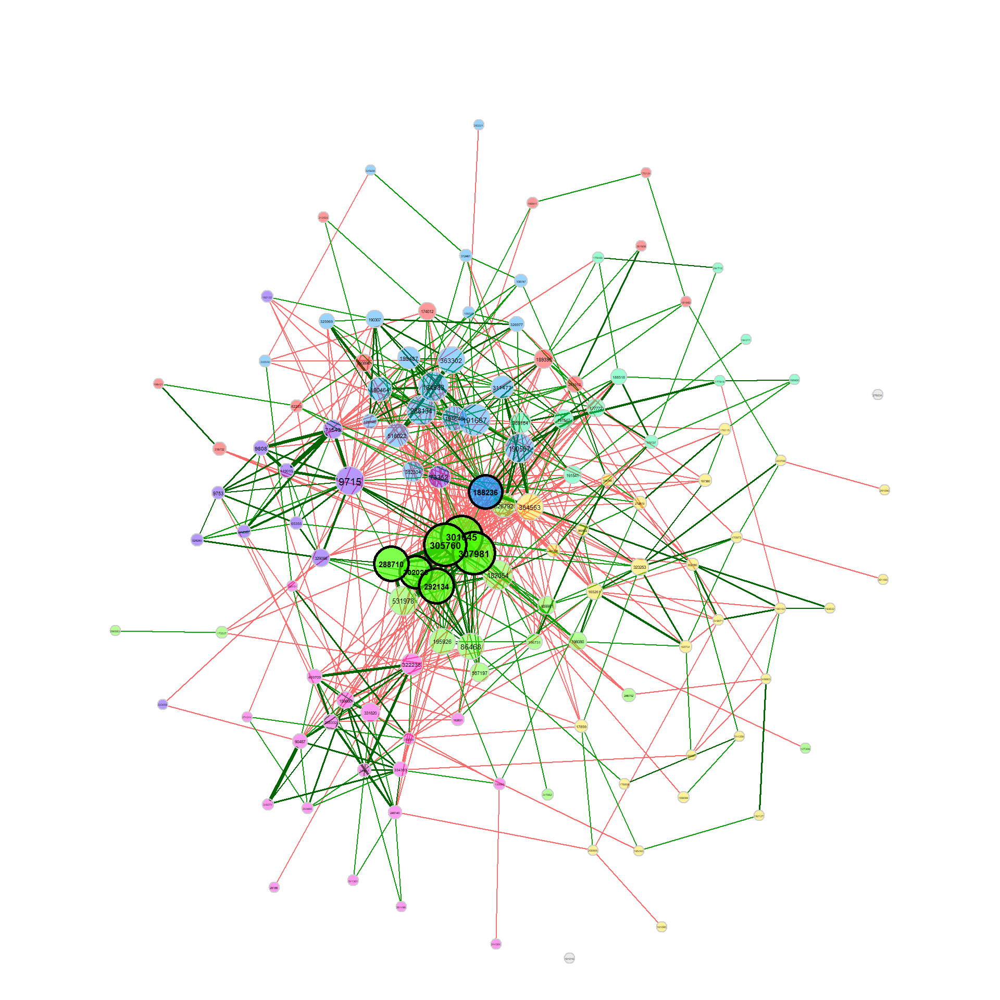
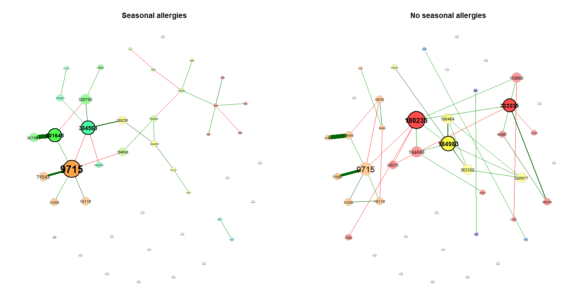
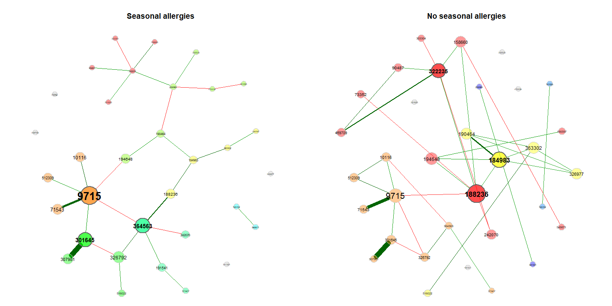
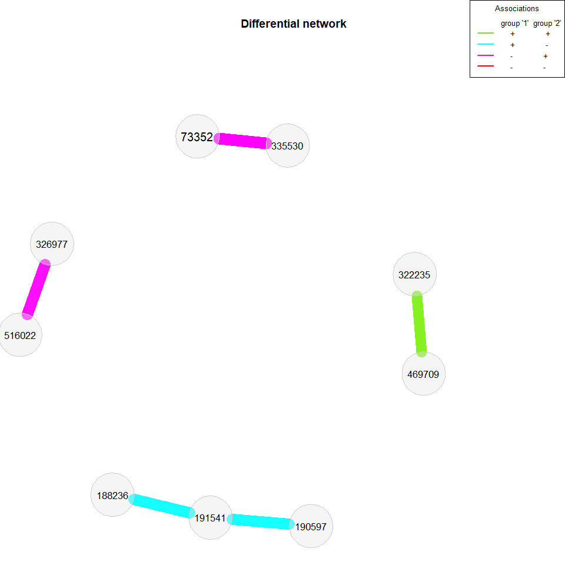
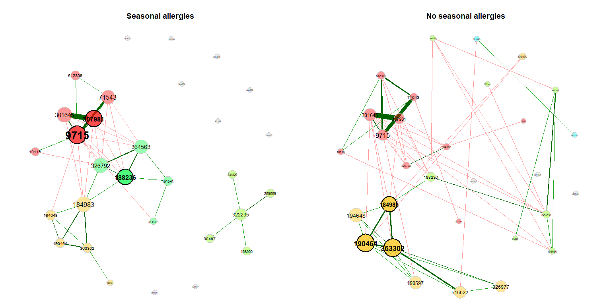
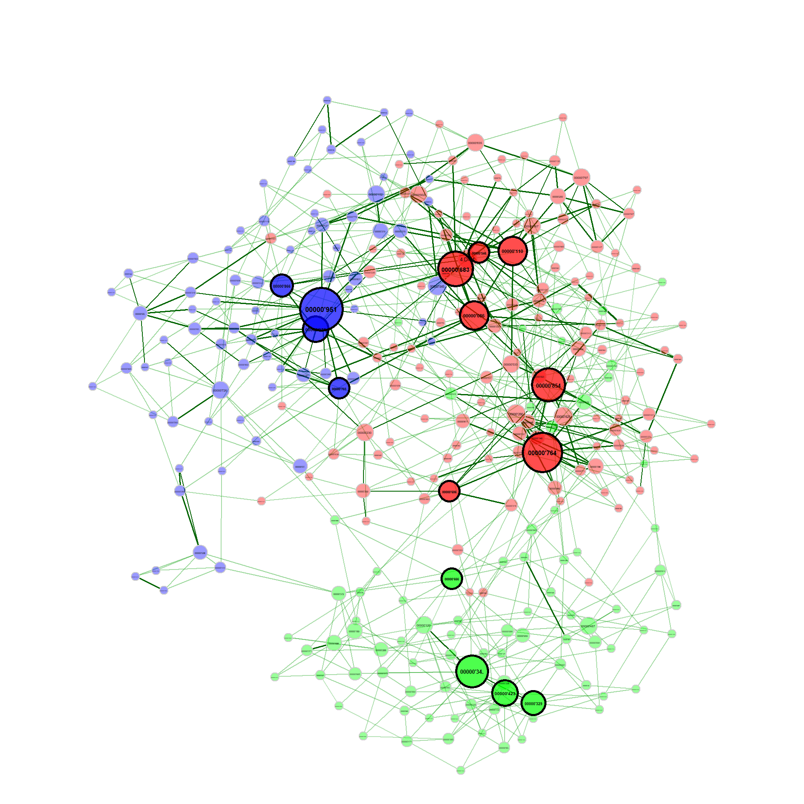

NetCoMi
=======

`NetCoMi` (Network Comparison for Microbiome data) provides functions
for constructing, analyzing, and comparing networks suitable for the
application on microbial compositional data. The package includes
existing methods for zero handling, normalization, estimating
associations between OTU/taxa as well as dissimilarities between
samples. Furthermore, a function for constructing differential
association networks including methods for identifying differentially
associated taxa is offered.



> Exemplary network comparison using soil microbiome data ([‘soilrep’
> data from phyloseq
> package](https://github.com/joey711/phyloseq/blob/master/data/soilrep.RData)).
> Microbial associations are compared between the two experimantal
> settings ‘warming’ and ‘non-warming’ using the same layout (determines
> node positions) in both groups.

Overview of methods included in NetCoMi
---------------------------------------

Here is an overview of methods available for network construction,
together with some information on the implementation in R.

**Association measures:**

-   Pearson coefficient
    ([`cor()`](https://www.rdocumentation.org/packages/stats/versions/3.6.2/topics/cor)
    from `stats` package)
-   Spearman coefficient
    ([`cor()`](https://www.rdocumentation.org/packages/stats/versions/3.6.2/topics/cor)
    from `stats` package)
-   Biweight Midcorrelation
    [`bicor()`](https://rdrr.io/cran/WGCNA/man/bicor.html) from `WGCNA`
    package
-   SparCC (own implementation in C++ based on
    [r-sparcc](https://github.com/MPBA/r-sparcc))
-   CCLasso ([R script on
    GitHub](https://github.com/huayingfang/CCLasso))
-   CCREPE
    ([`ccrepe`](https://bioconductor.org/packages/release/bioc/html/ccrepe.html)
    package)
-   SpiecEasi ([`SpiecEasi`](https://github.com/zdk123/SpiecEasi)
    package)
-   SPRING ([`SPRING`](https://github.com/zdk123/SpiecEasi) package)
-   gCoda ([R script on GitHub](https://github.com/huayingfang/gCoda))
-   propr
    ([`propr`](https://cran.r-project.org/web/packages/propr/index.html)
    package)

**Dissimilarity measures:**

-   Euclidean distance
    ([`vegdist()`](https://www.rdocumentation.org/packages/vegan/versions/2.4-2/topics/vegdist)
    from `vegan` package)
-   Bray-Curtis dissimilarity
    ([`vegdist()`](https://www.rdocumentation.org/packages/vegan/versions/2.4-2/topics/vegdist)
    from `vegan` package)
-   Kullback-Leibler divergence (KLD)
    ([`KLD()`](https://rdrr.io/cran/LaplacesDemon/man/KLD.html) from
    `LaplacesDemon` package)
-   Jeffrey divergence (own code using
    [`KLD()`](https://rdrr.io/cran/LaplacesDemon/man/KLD.html) from
    `LaplacesDemon` package)
-   Jensen-Shannon divergence (own code using
    [`KLD()`](https://rdrr.io/cran/LaplacesDemon/man/KLD.html) from
    `LaplacesDemon` package)
-   Compositional KLD (own implementation following \[Martín-Fernández
    et al., 1999\])
-   Aitchison distance
    ([`vegdist()`](https://www.rdocumentation.org/packages/vegan/versions/2.4-2/topics/vegdist)
    and [`cenLR()`](https://rdrr.io/cran/robCompositions/man/cenLR.html)
    from `robCompositions` package)

**Methods for zero replacement:**

-   Adding unit pseudo counts
-   Multiplicative replacement
    ([`multRepl`](https://rdrr.io/cran/zCompositions/man/multRepl.html)
    from `zCompositions` package)
-   Modified EM alr-algorithm
    ([`lrEM`](https://rdrr.io/cran/zCompositions/man/lrEM.html) from
    `zCompositions` package)
-   Bayesian-multiplicative replacement
    ([`cmultRepl`](https://rdrr.io/cran/zCompositions/man/cmultRepl.html)
    from `zCompositions` package)

**Normalization methods:**

-   Total Sum Scaling (TSS) (own implementation)
-   Cumulative Sum Scaling (CSS) ([`cumNormMat`]() from `metagenomeSeq`
    package)
-   Common Sum Scaling (COM) (own implementation)
-   Rarefying ([`rrarefy`]() from `vegan` package)
-   Variance Stabilizing Transformation (VST)
    ([`varianceStabilizingTransformation`]() from `DESeq2` package)
-   Centered log-ratio (clr) transformation
    ([`cenLR()`](https://rdrr.io/cran/robCompositions/man/cenLR.html)
    from `robCompositions` package))

TSS, CSS, COM, VST, and the clr transformation are described in \[Badri
et al., 2018\].

Installation
------------

``` r
#install.packages("devtools")

devtools::install_github("stefpeschel/NetCoMi", dependencies = TRUE,
                         repos = c("https://cloud.r-project.org/",
                                   BiocManager::repositories()))
```

If there are any errors during installation, please install the missing
dependencies manually.

Basic Usage
-----------

We use the American Gut data from
[`SpiecEasi`](https://github.com/zdk123/SpiecEasi) package to look at
some examples of how `NetCoMi` is applied. The main functions of
`NetCoMi` are `netConstruct()` for network construction, `netAnalyze()`
for network analysis, and `netCompare()` for network comparison. As you
will see in the following, these three functions must be executed in the
aforementioned order. A further function is `diffnet()` for constructing
a differential association network. `diffnet()` must be applied to the
object returned from `netConstruct()`.

### Network construction and analysis

First of all, we load `NetCoMi` and the data from American Gut Project
(provided by [`SpiecEasi`](https://github.com/zdk123/SpiecEasi), which
is automatically loaded together with `NetCoMi`).

``` r
library(NetCoMi)
data("amgut1.filt")
data("amgut2.filt.phy")
```

We construct a single association network using the SPIEC-EASI approach
for estimating associations (conditional dependence) between OTUs.
Additional arguments are passed to `spiec.easi()` via `measurePar`.
`nlambda` and `rep.num` are set to 20 for a decreased execution time,
but should be higher for real data.

Normalization as well as zero handling is performed internally in
`spiec.easi()`.

``` r
net_single <- netConstruct(amgut1.filt, verbose = 3, 
                           measure = "spieceasi",
                           measurePar = list(method = "mb", 
                                             nlambda=20, 
                                             pulsar.params=list(rep.num=20)),
                           normMethod = "none", zeroMethod = "none",
                           sparsMethod = "none", seed = 123456)
```

    ## 0 samples removed.

    ## 0 taxa removed.

    ## 127 taxa and 289 samples remaining.

    ## 
    ## Calculate 'spieceasi' associations ... 
    ## Applying data transformations...
    ## Selecting model with pulsar using stars...
    ## Fitting final estimate with mb...
    ## done
    ## Done.

**Analyze the constructed network**

Clusters are identified using greedy modularity optimization (by
`cluster_fast_greedy()` from [`igraph`](https://igraph.org/r/) package).

``` r
props_single <- netAnalyze(net_single, clustMethod = "cluster_fast_greedy")
```

**Visualize the network**

We use the determined clusters as node colors and scale the node sizes
according to the node’s eigenvector centrality.

``` r
# help page
?plot.microNetProps
```

``` r
plot(props_single, nodeColor = "cluster", nodeSize = "eigenvector")
```


Let’s construct another network using Pearson’s correlation coefficient
as association measure. Since Pearson correlations may lead to
compositional effects when applied to sequencing data, we use the clr
transformation as normalization method. Zero treatment is necessary if
the counts are clr transformed. Student’s t-test is used as
sparsification method, so that only OTUs with a correlation
significantly different from zero are connected.

``` r
net_single2 <- netConstruct(amgut1.filt, verbose = 0, 
                            measure = "pearson",
                            normMethod = "clr", zeroMethod = "multRepl",
                            sparsMethod = "t-test", adjust = "lfdr")

props_single2 <- netAnalyze(net_single2, clustMethod = "cluster_fast_greedy")

plot(props_single2, nodeColor = "cluster", nodeSize = "eigenvector")
```



### Network comparison

Now let’s look how two networks are compared using `NetCoMi`.

We use ‘SEASONAL\_ALLERGIES’, which is part of the phyloseq object, as
group variable. The [`metagMisc`](https://github.com/vmikk/metagMisc)
package offers a function for splitting phyloseq objects according to a
variable. The two resulting phyloseq objects (we ignore the group
‘None’) can directly be passed to `NetCoMi`.

We select the 50 nodes with highest variance to receive smaller
networks.

``` r
# devtools::install_github("vmikk/metagMisc")

amgut_split <- metagMisc::phyloseq_sep_variable(amgut2.filt.phy, 
                                                "SEASONAL_ALLERGIES")

net_season <- netConstruct(amgut_split$no, amgut_split$yes, verbose = 2, 
                           filtTax = "highestVar",
                           filtTaxPar = list(highestVar = 50),
                           measure = "spieceasi",
                           measurePar = list(method = "mb", 
                                             nlambda=20, 
                                             pulsar.params=list(rep.num=20)),
                           normMethod = "none", zeroMethod = "none",
                           sparsMethod = "none", seed = 123456)
```

    ## Data filtering ...

    ## 0 samples removed in data set 1.

    ## 0 samples removed in data set 2.

    ## 95 taxa removed in each data set.

    ## 1 rows with zero sum removed.

    ## 1 rows with zero sum removed in data set 2.

    ## 43 taxa and 162 samples remaining in data set 1.

    ## 43 taxa and 120 samples remaining in data set 2.

    ## 
    ## Calculate 'spieceasi' associations ... Done.
    ## 
    ## Calculate associations for group 2 ... Done.

Alternatively, a group vector could be passed to `group`, according to
which the data set is split into two groups.

``` r
# netConstruct expects samples in rows
countMat <- t(amgut2.filt.phy@otu_table@.Data)
group_vec <- phyloseq::get_variable(amgut2.filt.phy, "SEASONAL_ALLERGIES")

# select the two groups of interest
sel <- which(group_vec %in% c("no", "yes"))
group_vec <- group_vec[sel]
countMat <- countMat[sel, ]

net_season <- netConstruct(countMat, group = group_vec, verbose = 0,  
                           filtTax = "highestVar",
                           filtTaxPar = list(highestVar = 50),
                           measure = "spieceasi",
                           measurePar = list(method = "mb", 
                                             nlambda=20, 
                                             pulsar.params=list(rep.num=20)),
                           normMethod = "none", zeroMethod = "none",
                           sparsMethod = "none", seed = 123456)
```

**Analyze and plot the networks**

The object returned from `netConstruct()` containing both networks is
again passed to `netAnalyze()`. Network properties are computed for both
networks simultaneously.

For visualization, we use the same layout (the Fruchterman & Reingold
layout) in both groups. In this case, the layout is computed for the
left network and adopted to the right one.

``` r
props_season <- netAnalyze(net_season, clustMethod = "cluster_fast_greedy")

plot(props_season, sameLayout = TRUE, layoutGroup = 1,
     nodeSize = "eigenvector", cexNodes = 1.5, cexLabels = 1.8,
     groupNames = c("Seasonal allergies", "No seasonal allergies"))
```



Single nodes can be removed in order to improve readability (if the same
layout is used in both groups, only nodes being unconnected in both
networks are removed).

``` r
plot(props_season, rmSingles = "inboth", sameLayout = TRUE, layoutGroup = 1,
     nodeSize = "eigenvector", cexNodes = 1.5, cexLabels = 1.8,
     groupNames = c("Seasonal allergies", "No seasonal allergies"))
```



**Compare the networks quantitatively**

Since execution time is considerably increased if permutation tests are
performed, we set the `permTest` parameter to `FALSE`.

``` r
comp_season <- netCompare(props_season, permTest = FALSE, verbose = FALSE)
```

It can be chosen, which centrality measures the summary should contain.

``` r
summary(comp_season, showCentr = c("degree", "eigen"), numbTaxa = 5)
```

    ## 
    ## Comparison of Network Properties
    ## ----------------------------------
    ## 
    ## CALL: 
    ## netCompare(x = props_season, permTest = FALSE, verbose = FALSE)
    ## 
    ## 
    ## Jaccard index (similarity betw. sets of most central nodes):
    ## `````````````
    ##                     Jacc   P(<=Jacc)     P(>=Jacc)   
    ## degree             0.308   0.5520387     0.6775760   
    ## betweenness centr. 0.455   0.8779150     0.2889973   
    ## closeness centr.   0.375   0.7374313     0.4530638   
    ## eigenvec. centr.   0.375   0.7374313     0.4530638   
    ## hub taxa           0.000   0.0877915 .   1.0000000   
    ## -----
    ## Jaccard index ranges from 0 (compl. different) to 1 (sets equal)
    ## 
    ## 
    ## Global network properties:
    ## ``````````````````````````
    ##                     group '1'   group '2'    difference
    ## average path length     2.551       1.255         1.296
    ## clustering coeff.       0.000       0.150         0.150
    ## modularity              0.597       0.651         0.054
    ## vertex connectivity     0.000       0.000         0.000
    ## edge connectivity       0.000       0.000         0.000
    ## edge density            0.032       0.019         0.013
    ## 
    ## 
    ## Adjusted Rand index (similarity betw. clusterings):
    ## ```````````````````
    ##    ARI       p-value
    ##  0.339             0
    ## -----
    ## ARI in [-1,1] with ARI=1: perfect agreement betw. clusterings,
    ##                    ARI=0: expected for two random clusterings
    ## p-value: two-tailed test with null hypothesis ARI=0
    ## 
    ## 
    ## Centrality measures (sorted by decreasing diff.):
    ## ````````````````````
    ## Degree:
    ##        group '1' group '2' difference
    ## 364563     0.119     0.024      0.095
    ## 259569     0.095     0.000      0.095
    ## 469709     0.000     0.048      0.048
    ## 322235     0.119     0.071      0.048
    ## 470239     0.048     0.000      0.048
    ## 
    ## Eigenvector centrality:
    ##        group '1' group '2' difference
    ## 322235     0.058     0.937      0.879
    ## 188236     0.359     1.000      0.641
    ## 364563     0.756     0.127      0.630
    ## 469709     0.000     0.594      0.594
    ## 194648     0.364     0.854      0.490
    ## 
    ## --------------------------------------------------------
    ## Significance codes: ***: 0.001, **: 0.01, *: 0.05, .: 0.1

### Constructing a differential network

We now build a differential association network, where two nodes are
connected if they are differentially associated between the two groups.
We again apply Pearson’s correlations to the clr transformed data, but
this time a threshold is used as sparsification method so that two OTUs
are connected if their absolute correlation is above 0.3.

Fisher’s z-test is used for identifying differentially correlated OTUs,
which are connected in the network.

``` r
net_season2 <- netConstruct(amgut_split$no, amgut_split$yes, verbose = 0, 
                           filtTax = "highestVar",
                           filtTaxPar = list(highestVar = 50),
                           measure = "pearson", normMethod = "clr",
                           sparsMethod = "threshold", thresh = 0.3)

diff_season2 <- diffnet(net_season2, diffMethod = "fisherTest", adjust = "lfdr")
```

    ## Adjust for multiple testing using 'lfdr' ... 
    ## Execute fdrtool() ...

    ## Step 1... determine cutoff point
    ## Step 2... estimate parameters of null distribution and eta0
    ## Step 3... compute p-values and estimate empirical PDF/CDF
    ## Step 4... compute q-values and local fdr

    ## Done.

``` r
plot(diff_season2, mar = c(2,1,7,7), cexLegend = 0.8)
```



We also take a look at the association networks belonging to the
differential network.

``` r
props_season2 <- netAnalyze(net_season2, clustMethod = "cluster_fast_greedy")

plot(props_season2, rmSingles = "inboth", sameLayout = TRUE, layoutGroup = 1,
     shortenLabels = "intelligent", nodeSize = "eigenvector", 
     cexNodes = 1.5, cexLabels = 1.8, 
     groupNames = c("Seasonal allergies", "No seasonal allergies"))
```



### Dissimilarity-based Networks

If a dissimilarity measure is used for network construction, nodes are
subjects instead of OTUs. The estimated dissimilarities are transformed
to similarities, which are used as edge weights so that subjects with a
similar microbial composition are placed close together in the network
plot.

We construct a single network using Aitchison’s distance being suitable
for the application on compositional data.

Since the Aitchison distance is based on the clr-transformation, zeros
in the data need to be replaced.

The network is sparsified using the k-nearest neighbor (knn) algorithm.

``` r
net_aitchison <- netConstruct(amgut1.filt, verbose = 0, 
                              filtTax = "highestFreq",
                              filtTaxPar = list(highestFreq = 100),
                              measure = "aitchison",
                              zeroMethod = "multRepl",
                              sparsMethod = "knn", kNeighbor = 3)
```

For cluster detection, we use hierarchical clustering with average
linkage. Internally, `k=3` is passed to
[`cutree()`](https://www.rdocumentation.org/packages/dendextend/versions/1.13.4/topics/cutree)
from `stats` package so that the tree is cut into 3 clusters.

``` r
props_aitchison <- netAnalyze(net_aitchison,
                              clustMethod = "hierarchical",
                              clustPar = list(method = "average", k = 3),
                              hubPar = "degree")

plot(props_aitchison, nodeColor = "cluster", nodeSize = "degree",
     edgeTranspLow = 60)
```



### Soil microbiome example

Here is the code to produce the network plot shown at the beginning.

``` r
data("soilrep")
soil_warm <- metagMisc::phyloseq_sep_variable(soilrep, "warmed")

net_seas_p <- netConstruct(soil_warm$yes, soil_warm$no,
                         filtTax = "highestVar",
                         filtTaxPar = list(highestVar = 500),
                         verbose = 3, measure = "pearson", 
                         zeroMethod = "pseudo",
                         normMethod = "clr")

netprops1 <- netAnalyze(net_seas_p, clustMethod = "cluster_fast_greedy")

nclust <- as.numeric(max(names(table(netprops1$clustering$clust1))))
col <- topo.colors(nclust)

plot(netprops1, sameLayout = TRUE, layoutGroup = 1, colorVec = col,
     borderCol = "gray40", nodeSize = "degree", cexNodes = 35, 
     nodeSizeSpread = 0.1, edgeTranspLow = 80, edgeTranspHigh = 50,
     groupNames = c("Warming", "Non-warming"), showTitle = TRUE, cexTitle = 0.9,
     mar = c(1,1,3,1), repulsion = 0.9, labels = FALSE, rmSingles = "inboth",
     nodeFilter = "clustMin", nodeFilterPar = 10, 
     nodeTransp = 50, hubTransp = 30)
```

References
----------

\[Martín-Fernández et al., 1999\] Josep A Martín-Fernández, Mark J Bren,
Carles Barceló-Vidal, and Vera Pawlowsky-Glahn (1999). [A measure of
difference for compositional data based on measures of
divergence](http://ima.udg.edu/~barcelo/index_archivos/A_mesure_of_difference.pdf),
*Lippard, Næss, and Sinding-Larsen*, 211-216, 1999.)

\[Badri et al., 2018\] Michelle Badri, Zachary Kurtz, Christian Müller,
and Richard Bonneau. [Normalization methods for microbial abundance data
strongly affect correlation
estimates](https://www.biorxiv.org/content/10.1101/406264v1). *bioRxiv*,
2018. doi: 406264.
