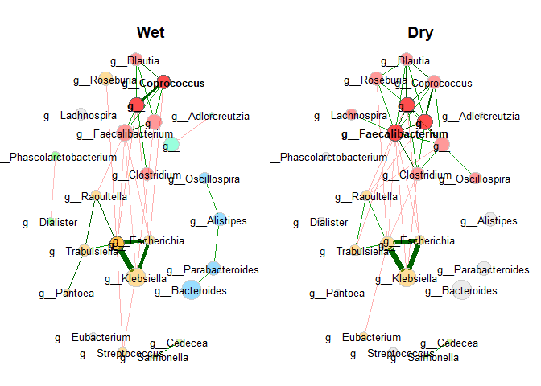
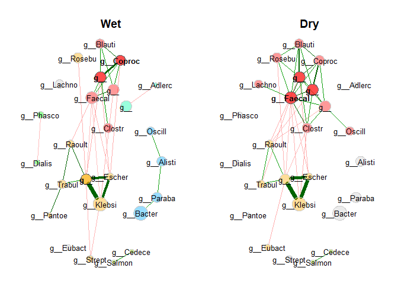
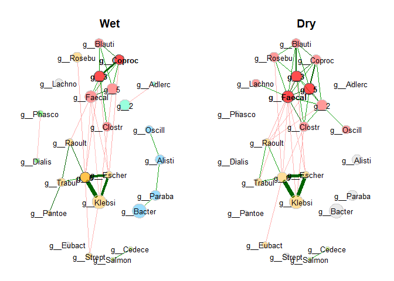
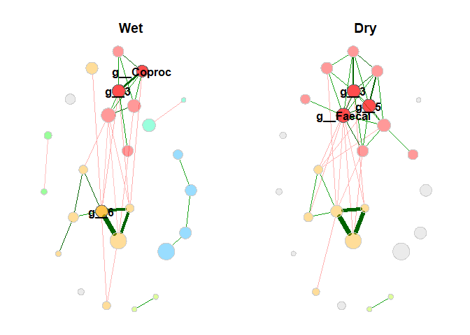

## Tutorial: How to adapt taxa names in the network plot 

#### Use genus names instead of ASV names: Method 1

In this method, genus names are passed as label vector to the plot
function, so that genus names are shown in the plot, but not in the
summary outputs.

``` r
library(NetCoMi)
library(phyloseq)
```

``` r
data("amgut2.filt.phy")

colnames(amgut2.filt.phy@tax_table@.Data) <- c("Kingdom","Phylum","Class",
                                               "Order", "Family", "Genus", 
                                               "Species")

# Agglomerate to genus level
amgut_genus <- tax_glom(amgut2.filt.phy,"Genus")

# Split data set into seasonal allergies = yes/no
levels(phyloseq::get_variable(amgut_genus, "SEASONAL_ALLERGIES"))
```

    ## [1] "no"   "None" "yes"

``` r
amgut_g_yes = subset_samples(amgut_genus, SEASONAL_ALLERGIES == "yes")
amgut_g_no = subset_samples(amgut_genus, SEASONAL_ALLERGIES == "no")


# Network construction
net_season <- netConstruct(data = amgut_g_yes, 
                           data2 = amgut_g_no,  
                           measure = "pearson",
                           normMethod = "clr", 
                           zeroMethod = "none",
                           sparsMethod = "threshold",
                           thresh = 0.4,
                           verbose = 1,
                           seed = 123456)
```

    ## Infos about changed arguments:

    ## Zero replacement needed for clr transformation. 'multRepl' used.

    ## 43 taxa and 120 samples remaining in group 1.

    ## 43 taxa and 162 samples remaining in group 2.

``` r
# Network analysis
props_season <- netAnalyze(net_season, 
                           clustMethod = "cluster_fast_greedy")

summary(props_season, showCentr = c("degree", "eigenvector"))
```

    ## 
    ## Component sizes
    ## ```````````````
    ## Group 1:               
    ## size: 14 4 2  1
    ##    #:  1 1 3 19
    ## 
    ## Group 2:             
    ## size: 16 2  1
    ##    #:  1 1 25
    ## ______________________________
    ## Global network properties
    ## `````````````````````````
    ## Largest connected component (LCC):
    ##                          group '1' group '2'
    ## Relative LCC size          0.32558   0.37209
    ## Clustering coefficient     0.56856   0.62305
    ## Moduarity                  0.22977   0.15556
    ## Positive edge percentage  59.25926  70.73171
    ## Edge density               0.29670   0.34167
    ## Natural connectivity       0.12468   0.13246
    ## Vertex connectivity        1.00000   1.00000
    ## Edge connectivity          1.00000   1.00000
    ## Average dissimilarity*     0.88722   0.86053
    ## Average path length**      1.38906   1.27974
    ## 
    ## Whole network:
    ##                          group '1' group '2'
    ## Number of components      24.00000  27.00000
    ## Clustering coefficient     0.48109   0.62305
    ## Moduarity                  0.41139   0.18849
    ## Positive edge percentage  60.60606  71.42857
    ## Edge density               0.03654   0.04651
    ## Natural connectivity       0.02994   0.03447
    ## 
    ##  *Dissimilarity = 1 - edge weight
    ## **Path length: Units with average dissimilarity
    ## 
    ## ______________________________
    ## Clusters
    ## - In the whole network
    ## - Algorithm: cluster_fast_greedy
    ## ```````````````````````````````` 
    ## group '1':                    
    ## name:  0 1 2 3 4 5 6
    ##    #: 19 8 2 2 4 6 2
    ## 
    ## group '2':               
    ## name:  0 1  2 3
    ##    #: 25 6 10 2
    ## 
    ## ______________________________
    ## Hubs
    ## - In alphabetical/numerical order
    ## - Based on empirical quantiles of centralities
    ## ```````````````````````````````````````````````
    ##  group '1' group '2'
    ##     190307    184983
    ##     190464    188236
    ##     301645    190464
    ## 
    ## ______________________________
    ## Centrality measures
    ## - In decreasing order
    ## - Centrality of disconnected components is zero
    ## ````````````````````````````````````````````````
    ## Degree (normalized):
    ##         group '1' group '2'
    ##  301645   0.19048   0.19048
    ##  188236   0.16667   0.28571
    ##  190464   0.14286   0.21429
    ##  305760   0.11905   0.09524
    ##  190307   0.11905   0.11905
    ##            ______    ______
    ##  188236   0.16667   0.28571
    ##  190464   0.14286   0.21429
    ##  301645   0.19048   0.19048
    ##  311477         0   0.16667
    ##  184983   0.09524   0.16667
    ## 
    ## Eigenvector centrality (normalized):
    ##         group '1' group '2'
    ##  190307         1   0.79318
    ##  190464   0.94119   0.97425
    ##  301645   0.92965    0.2581
    ##  188236   0.89014         1
    ##  305760   0.79044   0.21057
    ##            ______    ______
    ##  188236   0.89014         1
    ##  190464   0.94119   0.97425
    ##  184983   0.76936   0.90943
    ##  190307         1   0.79318
    ##  311477         0   0.78083

``` r
# Create label vector
labels <- as.vector(tax_table(amgut_genus)[, "Genus"])
names(labels) <- rownames(tax_table(amgut_genus))

# Optional: Shorten labels to a desired length
#labels <- substr(labels, 1, 9)

plot(props_season, 
     repulsion = 0.9,
     labels = labels,
     sameLayout = TRUE, 
     layoutGroup = "union",
     rmSingles = "inboth", 
     shortenLabels = "intelligent",
     labelPattern = c(5,"'",3),
     labelLength = 10,
     nodeSize = "mclr", 
     labelScale = FALSE,
     cexNodes = 1.5, 
     cexLabels = 0.8,
     cexHubLabels = 0.8,
     cexTitle = 1.2,
     groupNames = c("Wet", "Dry"),
     hubBorderCol  = "gray40",
     mar = c(2, 6, 4, 6))
```

<!-- -->

``` r
# With shortened node labels:
labels <- substr(labels, 1, 9)

plot(props_season, 
     repulsion = 0.9,
     labels = labels,
     sameLayout = TRUE, 
     layoutGroup = "union",
     rmSingles = "inboth", 
     shortenLabels = "intelligent",
     labelPattern = c(5,"'",3),
     labelLength = 10,
     nodeSize = "mclr", 
     labelScale = FALSE,
     cexNodes = 1.5, 
     cexLabels = 0.8,
     cexHubLabels = 0.8,
     cexTitle = 1.2,
     groupNames = c("Wet", "Dry"),
     hubBorderCol  = "gray40",
     mar = c(2, 6, 4, 6))
```

<!-- -->

#### Use genus names instead of ASV names: Method 2

In this method, row names of the count table (stored as `otu_table` in
the phyloseq object) are set to genus names.

Advantages:

-   Genus names are shown in the summaries
-   The functionality for adapting labels provided by NetCoMi’s plot
    function can be applied

``` r
data("amgut2.filt.phy")

colnames(amgut2.filt.phy@tax_table@.Data) <- c("Kingdom","Phylum","Class",
                                               "Order", "Family", "Genus", 
                                               "Species")

# Agglomerate to genus level
amgut_genus <- tax_glom(amgut2.filt.phy,"Genus")

# Split data set into seasonal allergies = yes/no
levels(phyloseq::get_variable(amgut_genus, "SEASONAL_ALLERGIES"))
```

    ## [1] "no"   "None" "yes"

``` r
amgut_g_yes = subset_samples(amgut_genus, SEASONAL_ALLERGIES == "yes")
amgut_g_no = subset_samples(amgut_genus, SEASONAL_ALLERGIES == "no")


# Rename taxa
# (Since NetCoMi uses only the otu table, we just rename it's rownames)
g_names <- as.vector(tax_table(amgut_genus)[, "Genus"])

taxtab <- amgut_genus@tax_table@.Data

# Make labels unique
duplis <- g_names[duplicated(g_names) | duplicated(g_names, fromLast=TRUE)]
  
while(length(duplis) > 0){
    duplis.sel <- duplis[duplis == duplis[1]]
      
    g_names[g_names == duplis.sel[1]] <- paste0(duplis.sel[1], 1:length(duplis.sel))
      
      duplis <- g_names[duplicated(g_names) | duplicated(g_names, fromLast=TRUE)]
}

rownames(amgut_g_yes@otu_table@.Data) <- g_names
rownames(amgut_g_no@otu_table@.Data) <- g_names


# Network construction
net_season <- netConstruct(data = amgut_g_yes, 
                           data2 = amgut_g_no,  
                           measure = "pearson",
                           normMethod = "clr", 
                           zeroMethod = "none",
                           sparsMethod = "threshold",
                           thresh = 0.4,
                           verbose = 1,
                           seed = 123456)
```

    ## Infos about changed arguments:

    ## Zero replacement needed for clr transformation. 'multRepl' used.

    ## 43 taxa and 120 samples remaining in group 1.

    ## 43 taxa and 162 samples remaining in group 2.

``` r
# Network analysis
props_season <- netAnalyze(net_season, 
                           clustMethod = "cluster_fast_greedy")

# Network analysis summary (which now shows genus names)
summary(props_season, showCentr = c("degree", "eigenvector"))
```

    ## 
    ## Component sizes
    ## ```````````````
    ## Group 1:               
    ## size: 14 4 2  1
    ##    #:  1 1 3 19
    ## 
    ## Group 2:             
    ## size: 16 2  1
    ##    #:  1 1 25
    ## ______________________________
    ## Global network properties
    ## `````````````````````````
    ## Largest connected component (LCC):
    ##                          group '1' group '2'
    ## Relative LCC size          0.32558   0.37209
    ## Clustering coefficient     0.56856   0.62305
    ## Moduarity                  0.22977   0.15556
    ## Positive edge percentage  59.25926  70.73171
    ## Edge density               0.29670   0.34167
    ## Natural connectivity       0.12468   0.13246
    ## Vertex connectivity        1.00000   1.00000
    ## Edge connectivity          1.00000   1.00000
    ## Average dissimilarity*     0.88722   0.86053
    ## Average path length**      1.38906   1.27974
    ## 
    ## Whole network:
    ##                          group '1' group '2'
    ## Number of components      24.00000  27.00000
    ## Clustering coefficient     0.48109   0.62305
    ## Moduarity                  0.41139   0.18849
    ## Positive edge percentage  60.60606  71.42857
    ## Edge density               0.03654   0.04651
    ## Natural connectivity       0.02994   0.03447
    ## 
    ##  *Dissimilarity = 1 - edge weight
    ## **Path length: Units with average dissimilarity
    ## 
    ## ______________________________
    ## Clusters
    ## - In the whole network
    ## - Algorithm: cluster_fast_greedy
    ## ```````````````````````````````` 
    ## group '1':                    
    ## name:  0 1 2 3 4 5 6
    ##    #: 19 8 2 2 4 6 2
    ## 
    ## group '2':               
    ## name:  0 1  2 3
    ##    #: 25 6 10 2
    ## 
    ## ______________________________
    ## Hubs
    ## - In alphabetical/numerical order
    ## - Based on empirical quantiles of centralities
    ## ```````````````````````````````````````````````
    ##       group '1'           group '2'
    ##            g__3                g__3
    ##            g__6                g__5
    ##  g__Coprococcus g__Faecalibacterium
    ## 
    ## ______________________________
    ## Centrality measures
    ## - In decreasing order
    ## - Centrality of disconnected components is zero
    ## ````````````````````````````````````````````````
    ## Degree (normalized):
    ##                      group '1' group '2'
    ##                 g__6   0.19048   0.19048
    ##  g__Faecalibacterium   0.16667   0.28571
    ##                 g__3   0.14286   0.21429
    ##       g__Escherichia   0.11905   0.09524
    ##       g__Coprococcus   0.11905   0.11905
    ##                         ______    ______
    ##  g__Faecalibacterium   0.16667   0.28571
    ##                 g__3   0.14286   0.21429
    ##                 g__6   0.19048   0.19048
    ##                 g__2         0   0.16667
    ##                 g__5   0.09524   0.16667
    ## 
    ## Eigenvector centrality (normalized):
    ##                      group '1' group '2'
    ##       g__Coprococcus         1   0.79318
    ##                 g__3   0.94119   0.97425
    ##                 g__6   0.92965    0.2581
    ##  g__Faecalibacterium   0.89014         1
    ##       g__Escherichia   0.79044   0.21057
    ##                         ______    ______
    ##  g__Faecalibacterium   0.89014         1
    ##                 g__3   0.94119   0.97425
    ##                 g__5   0.76936   0.90943
    ##       g__Coprococcus         1   0.79318
    ##                 g__2         0   0.78083

``` r
plot(props_season, 
     repulsion = 0.9,
     sameLayout = TRUE, 
     layoutGroup = "union",
     rmSingles = "inboth", 
     shortenLabels = "simple",
     labelLength = 9,
     nodeSize = "mclr", 
     labelScale = FALSE,
     cexNodes = 1.5, 
     cexLabels = 0.8,
     cexHubLabels = 0.8,
     cexTitle = 1.2,
     groupNames = c("Wet", "Dry"),
     hubBorderCol  = "gray40",
     mar = c(2, 6, 4, 6))
```

<!-- -->

#### Only hub nodes are labeled

If `cexLabels` is set to zero, only the hub node’s labels are plotted.

``` r
plot(props_season, 
     repulsion = 0.9,
     sameLayout = TRUE, 
     layoutGroup = "union",
     rmSingles = "inboth", 
     shortenLabels = "simple",
     labelLength = 9,
     nodeSize = "mclr", 
     labelScale = FALSE,
     cexNodes = 1.5, 
     cexLabels = 0,
     cexHubLabels = 1,
     cexTitle = 1.2,
     groupNames = c("Wet", "Dry"),
     hubBorderCol  = "gray40",
     mar = c(2, 6, 4, 6))
```

<!-- -->
