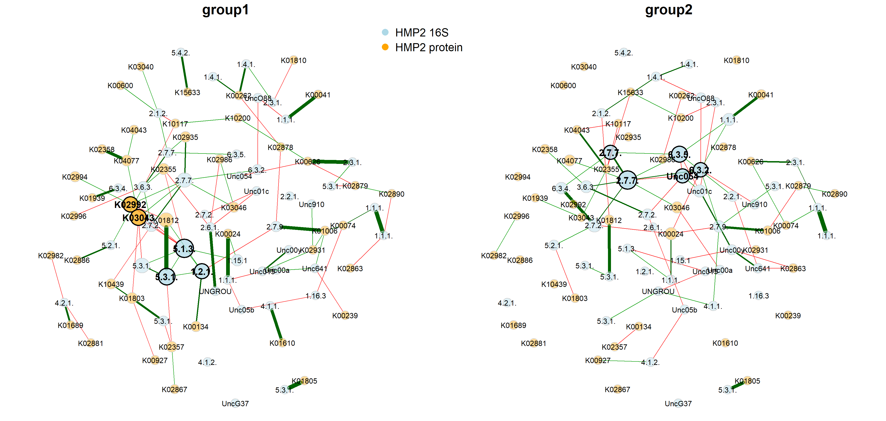

## Tutorial: How to compare cross-domain association networks using NetCoMi and SpiecEasi? 

In this tutorial, we use the same data as in the “Cross domain
interactions” section of the [SpiecEasi
tutorial](https://github.com/zdk123/SpiecEasi).

The samples are split into two groups and cross-domain associations are
computed for each group using SpiecEasi. The association matrices are
then passed to NetCoMi’s netConstruct() function to conduct a network
comparison between the two groups.

**Note:**  
This tutorial explains how two cross-domain networks are constructed and
compared. For constructing a single network, skip the step where the
data are split into two groups and perform the framework only for a
single data set (i.e. pass the estimated association matrix to the
“data” argument of netConstruct() and continue with NetCoMi’s standard
pipeline).

``` r
library(SpiecEasi)
library(phyloseq)

data(hmp2)

# Store count matrices (taxa are columns)
counts_hmp216S <- as.matrix(t(phyloseq::otu_table(hmp216S)@.Data))
counts_hmp2prot <- as.matrix(t(phyloseq::otu_table(hmp2prot)@.Data))

# Assume, the first 23 samples are in one group and the remaining 24 samples in the other group
group_vec <- c(rep(1, 23), rep(2, 24))

# Split count matrices
counts_hmp216S_gr1 <- counts_hmp216S[group_vec == 1, ]
counts_hmp216S_gr2 <- counts_hmp216S[group_vec == 2, ]

counts_hmp2prot_gr1 <- counts_hmp2prot[group_vec == 1, ]
counts_hmp2prot_gr2 <- counts_hmp2prot[group_vec == 2, ]

set.seed(123456)

# Run SpiecEasi and create association matrix for group 1
spiec_result_gr1 <- multi.spiec.easi(list(counts_hmp216S_gr1, counts_hmp2prot_gr1), 
                                 method='mb', nlambda=40, 
                                 lambda.min.ratio=1e-2, 
                                 pulsar.params = list(thresh = 0.05))
```

    ## Warning in spiec.easi.list(datalist, method = method, sel.criterion =
    ## sel.criterion, : input list contains data of mixed classes.

    ## Applying data transformations...

    ## Selecting model with pulsar using stars...

    ## Fitting final estimate with mb...

    ## done

``` r
assoMat1 <- SpiecEasi::symBeta(SpiecEasi::getOptBeta(spiec_result_gr1), mode = "ave")

assoMat1 <- as.matrix(assoMat1)

# Run SpiecEasi and create association matrix for group 2
spiec_result_gr2 <- multi.spiec.easi(list(counts_hmp216S_gr2, counts_hmp2prot_gr2), 
                                 method='mb', nlambda=40, 
                                 lambda.min.ratio=1e-2, 
                                 pulsar.params = list(thresh = 0.05))
```

    ## Warning in spiec.easi.list(datalist, method = method, sel.criterion =
    ## sel.criterion, : input list contains data of mixed classes.

    ## Applying data transformations...

    ## Selecting model with pulsar using stars...

    ## Fitting final estimate with mb...

    ## done

``` r
assoMat2 <- SpiecEasi::symBeta(SpiecEasi::getOptBeta(spiec_result_gr2), mode = "ave")

assoMat2 <- as.matrix(assoMat2)

# Get taxa names
taxnames <- c(taxa_names(hmp216S), taxa_names(hmp2prot))

colnames(assoMat1) <- rownames(assoMat1) <- taxnames
diag(assoMat1) <- 1

colnames(assoMat2) <- rownames(assoMat2) <- taxnames
diag(assoMat2) <- 1
```

``` r
# NetCoMi workflow 

library(NetCoMi)
```

    ## 

``` r
# Network construction (pass association matrices to netConstruct)
# - sparsMethod must be set to "none" because sparsification is already included in SpiecEasi
net_hmp_16S_prot <- netConstruct(data = assoMat1, data2 = assoMat2, 
                                 dataType = "condDependence", 
                                 sparsMethod = "none")

# Network analysis
netprops_hmp_16S_prot <- netAnalyze(net_hmp_16S_prot, hubPar = "eigenvector")
```

``` r
nodeCols <- c(rep("lightblue", ntaxa(hmp216S)), rep("orange", ntaxa(hmp2prot)))
names(nodeCols) <- taxnames

plot(netprops_hmp_16S_prot, 
     sameLayout = TRUE, 
     layoutGroup = "union",
     nodeColor = "colorVec", 
     colorVec = nodeCols,
     nodeSize = "eigen", 
     nodeSizeSpread = 2,
     labelScale = FALSE,
     cexNodes = 2, 
     cexLabels = 2,
     cexHubLabels = 2.5,
     cexTitle = 3.8,
     groupNames = c("group1", "group2"))


legend(-0.2, 1.2, cex = 3, pt.cex = 4, 
       legend = c("HMP2 16S", "HMP2 protein"), col = c("lightblue", "orange"), 
       bty = "n", pch = 16) 
```

<!-- -->

``` r
# Network comparison
# - Permutation tests cannot be performed because the association matrices are
#   used for network construction. For permutation tests, however, the count 
#   data are needed.
netcomp_hmp_16S_prot <- netCompare(netprops_hmp_16S_prot, permTest = FALSE)

summary(netcomp_hmp_16S_prot, groupNames = c("group1", "group2"))
```

    ## 
    ## Comparison of Network Properties
    ## ----------------------------------
    ## CALL: 
    ## netCompare(x = netprops_hmp_16S_prot, permTest = FALSE)
    ## 
    ## ______________________________
    ## Global network properties
    ## `````````````````````````
    ## Largest connected component (LCC):
    ##                          group1   group2    difference
    ## Relative LCC size         0.818    0.614         0.205
    ## Clustering coefficient    0.042    0.128         0.086
    ## Moduarity                 0.661    0.637         0.024
    ## Positive edge percentage 62.222   57.576         4.646
    ## Edge density              0.035    0.046         0.011
    ## Natural connectivity      0.017    0.022         0.006
    ## Vertex connectivity       1.000    1.000         0.000
    ## Edge connectivity         1.000    1.000         0.000
    ## Average dissimilarity*    0.989    0.986         0.003
    ## Average path length**     3.848    3.638         0.210
    ## 
    ## Whole network:
    ##                          group1   group2    difference
    ## Number of components     10.000   27.000        17.000
    ## Clustering coefficient    0.041    0.116         0.075
    ## Moduarity                 0.695    0.693         0.002
    ## Positive edge percentage 62.887   60.000         2.887
    ## Edge density              0.025    0.020         0.006
    ## Natural connectivity      0.013    0.013         0.000
    ## -----
    ##  *: Dissimilarity = 1 - edge weight
    ## **Path length: Units with average dissimilarity
    ## 
    ## ______________________________
    ## Jaccard index (similarity betw. sets of most central nodes)
    ## ``````````````````````````````````````````````````````````
    ##                     Jacc   P(<=Jacc)     P(>=Jacc)   
    ## degree             0.138    0.016100 *    0.995512   
    ## betweenness centr. 0.222    0.105480      0.948638   
    ## closeness centr.   0.257    0.221235      0.873473   
    ## eigenvec. centr.   0.222    0.105480      0.948638   
    ## hub taxa           0.000    0.017342 *    1.000000   
    ## -----
    ## Jaccard index ranges from 0 (compl. different) to 1 (sets equal)
    ## 
    ## ______________________________
    ## Adjusted Rand index (similarity betw. clusterings)
    ## ``````````````````````````````````````````````````
    ##    ARI       p-value
    ##  0.056         0.005
    ## -----
    ## ARI in [-1,1] with ARI=1: perfect agreement betw. clusterings,
    ##                    ARI=0: expected for two random clusterings
    ## p-value: two-tailed test with null hypothesis ARI=0
    ## 
    ## ______________________________
    ## Centrality measures
    ## - In decreasing order
    ## - Centrality of disconnected components is zero
    ## ````````````````````````````````````````````````
    ## Degree (normalized):
    ##          group1 group2 abs.diff.
    ## 5.1.3.3   0.092  0.023     0.069
    ## 6.3.5.5   0.011  0.069     0.057
    ## 1.2.1.12  0.057  0.000     0.057
    ## K02992    0.057  0.000     0.057
    ## 6.3.2.6   0.023  0.069     0.046
    ## 2.6.1.52  0.046  0.000     0.046
    ## K00626    0.046  0.000     0.046
    ## K03043    0.069  0.023     0.046
    ## Unc054vi  0.011  0.046     0.034
    ## Unc00y95  0.011  0.046     0.034
    ## 
    ## Betweenness centrality (normalized):
    ##          group1 group2 abs.diff.
    ## 5.1.3.3   0.421  0.033     0.388
    ## 6.3.5.5   0.000  0.348     0.348
    ## 2.7.7.6   0.208  0.542     0.334
    ## Unc01c0q  0.028  0.352     0.324
    ## 6.3.2.6   0.082  0.404     0.322
    ## 1.2.1.12  0.308  0.000     0.308
    ## 2.3.1.29  0.028  0.234     0.206
    ## K15633    0.000  0.174     0.174
    ## K01006    0.234  0.074     0.160
    ## 3.6.3.14  0.265  0.125     0.140
    ## 
    ## Closeness centrality (normalized):
    ##          group1 group2 abs.diff.
    ## 1.2.1.12  0.468  0.000     0.468
    ## K02992    0.463  0.000     0.463
    ## 6.3.4.4   0.000  0.435     0.435
    ## 2.2.1.1   0.000  0.411     0.411
    ## K02935    0.394  0.000     0.394
    ## 4.1.1.49  0.000  0.393     0.393
    ## 2.6.1.52  0.392  0.000     0.392
    ## K10439    0.381  0.000     0.381
    ## K02357    0.365  0.000     0.365
    ## K00074    0.362  0.000     0.362
    ## 
    ## Eigenvector centrality (normalized):
    ##          group1 group2 abs.diff.
    ## 5.1.3.3   1.000  0.028     0.972
    ## 5.3.1.12  0.816  0.055     0.762
    ## K03043    0.748  0.000     0.747
    ## 6.3.5.5   0.032  0.743     0.712
    ## K02992    0.682  0.000     0.682
    ## 1.2.1.12  0.651  0.000     0.651
    ## 5.3.1.25  0.608  0.014     0.594
    ## Unc054vi  0.001  0.551     0.550
    ## K01812    0.591  0.155     0.436
    ## 2.7.7.8   0.127  0.553     0.426
    ## 
    ## _________________________________________________________
    ## Significance codes: ***: 0.001, **: 0.01, *: 0.05, .: 0.1
